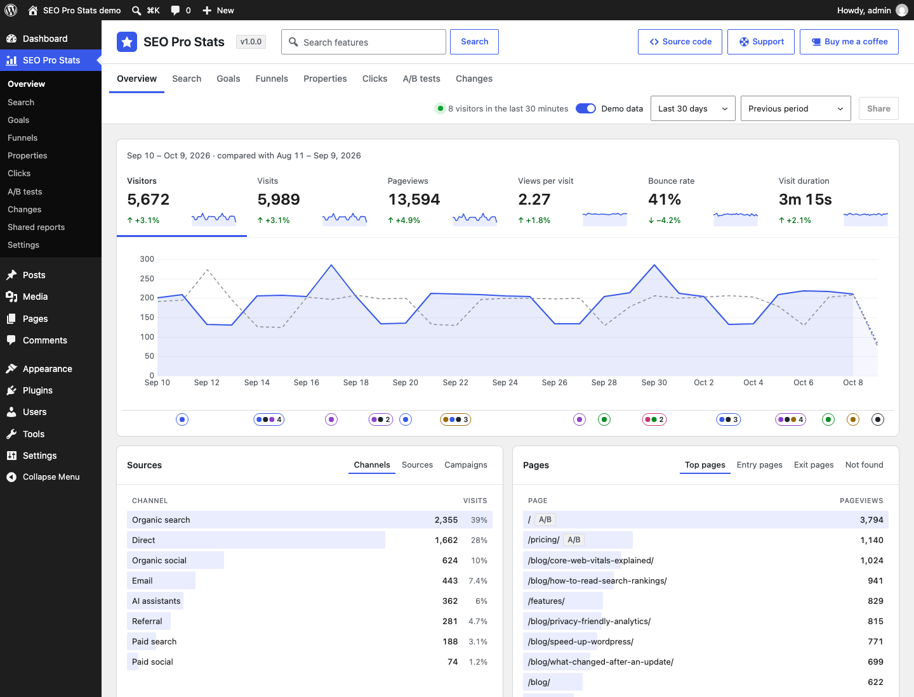
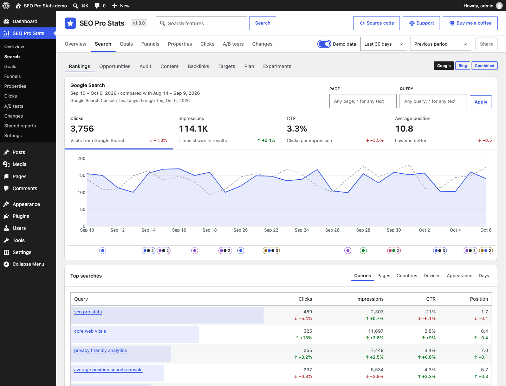
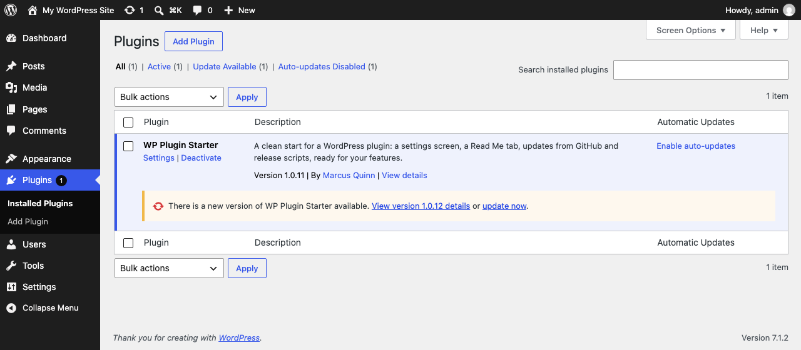

# SEO Pro Stats

<!-- aidevops:badges:start -->
<!-- managed by aidevops badges; edit the template, not this block -->
<!-- Build & Quality Status -->
[](https://github.com/wpallstars/seoprostats/actions/workflows/ci.yml)

<!-- License & Legal -->
[](https://github.com/wpallstars/seoprostats/blob/main/LICENSE)

<!-- WordPress Plugin -->
[](https://github.com/wpallstars/seoprostats/blob/main/readme.txt)
[](https://github.com/wpallstars/seoprostats/blob/main/readme.txt)
[](https://github.com/wpallstars/seoprostats/blob/main/readme.txt)

<!-- Repository Metrics -->
[](docs/metrics/repo-metrics.md)
[](docs/metrics/repo-metrics.md)
[](docs/metrics/repo-metrics.md)

<!-- Project Links -->
[](https://github.com/wpallstars/seoprostats)
<!-- aidevops:badges:end -->

Privacy-friendly site statistics in WordPress: visits, pages, sources and goals, kept in your own database without cookies or outside services.

SEO Pro Stats is what wpallstars plugins are made from. It has no features of its own: it holds the parts every plugin needs, built and tested in real plugins, so a new plugin starts with them working and spends its time on what makes it different.

If this saves you time, headaches and costs, feel free to [buy me a coffee](https://buymeacoffee.com/marcusquinn), or whatever you like, to invest in making more things open-source.

Version: 0.1.0

<!-- github-only:start -->
## Screenshots

**Settings → SEO Pro Stats**: the General tab, empty until features add settings, with search and the Source code, Support and Buy me a coffee links.



**The Read Me tab** shows this file inside WordPress, banner included.



**Updates from GitHub** (GitHub build): each GitHub release is offered on the Plugins screen as a normal WordPress update.


<!-- github-only:end -->

## What you get

- **A settings screen** (Settings → SEO Pro Stats) that features fill by declaring their settings: switches, numbers, text, lists, choices and Media Library pictures, saved instantly with no Save button, searchable, in tabs. With no features yet it shows one empty tab.
- **A Read Me tab** that shows this file, banner included, so users read the same guide inside WordPress as on GitHub.
- **Features as classes**: one file per feature, off by default, with settings, hooks, one-off imports from the plugins it replaces and clean uninstall.
- **Replaced plugins**: a feature that does another plugin's job imports its settings once, waits while that plugin is active, and the Plugins screen suggests deactivating and deleting it.
- **Updates from GitHub**: the shared wpallstars updater (`includes/github-updater/`). Sites get each GitHub release as a normal WordPress update. Every wpallstars plugin carries a copy and only the newest copy on a site runs, so they are all checked together, once.
- **Two builds of each version**: the GitHub release, and a WordPress.org build without the updater, as WordPress.org requires.
- **Scripts and CI**: lint (PHP 7.4, WordPress coding and security rules, PHPStan), a smoke test on a real WordPress, the release build, a preflight check of both zips, Plugin Check, a preview site, the banner and icon build, and `scripts/sync-core.sh` to keep each plugin's shared parts the same as the starter's.
- **Shared rules for people and AI**: `STANDARDS.md` (structure, code rules, performance, releases, styling, testing), `DEVELOPMENT.md` (set-up and checks) and `RELEASING.md`, the same in every plugin made from the starter.

## Start a plugin

1. On GitHub, choose **Use this template** to make your repository, and clone it.
2. Give it its names: `scripts/rename-plugin.sh --slug my-plugin --name "My Plugin" --prefix MyPlugin`. Add `--css mp` for a short CSS prefix and `--repo owner/repo` if it is not under wpallstars. Put in your own details too, or the plugin keeps the starter's: `--description`, `--author`, `--author-uri`, `--contributors` (WordPress.org usernames) and `--donate` (a link, or `none`); `--help` lists them all. The new plugin starts at version 0.1.0 (`--version` for another) with a changelog of its own. Review with `git diff`, then commit.
3. Replace this README, `readme.txt`, `changelog.txt` and `AGENTS.md` with your plugin's own, its banner and icon (`.wordpress-org/banner.svg` and `icon.svg`, then `scripts/build-banner.sh`), and screenshots (`.wordpress-org/screenshot-N.png` with captions in `readme.txt`, and GitHub-only ones in `docs/images/`). Keep the licence and the starter's credit, as its licence requires (`ATTRIBUTION.txt`, `STANDARDS.md` → Structure): GPL-3.0-or-later, `LICENSE`, `ATTRIBUTION.txt`, the licence lines at the top of each file, both copyright lines in the main file and this README's License section, and the "Made from" line here and in `readme.txt`. Please keep the rest of the Built with AI section too.
4. Add features: a class in `includes/features/` listed in `MyPlugin_Setup::FEATURES` (see Developers below and `STANDARDS.md`).
5. Keep the shared parts up to date: change them in the starter first, then run `scripts/sync-core.sh` in each plugin (`--check` lists what differs).

The easiest way to do all of this is with [aidevops](https://aidevops.sh): open the repository with it and describe the plugin you want. It reads `AGENTS.md` and `STANDARDS.md`, builds the features, tests them on a real site and runs the release checks.

## Where to find it

Go to **Settings → SEO Pro Stats**. The screen has two groups of tabs:

- **Settings**: General, empty until features add settings. Changes save instantly; there is no Save button. **Search features** (next to the plugin name) finds settings on every tab.
- **About**: this Read Me.

At the top right of the screen, **Source code** opens the plugin’s [GitHub repository](https://github.com/wpallstars/seoprostats) in a new tab, and **Support** opens its [GitHub issues](https://github.com/wpallstars/seoprostats/issues) in a new tab. Say what you did, what you expected and what happened, with the versions of WordPress, PHP and SEO Pro Stats. Leave out passwords, licence keys and personal data, since issues are public. For questions, ask [aidevops](https://aidevops.sh) (Built with AI below). **Buy me a coffee**, next to it, opens the maker’s [Buy Me a Coffee](https://buymeacoffee.com/marcusquinn) page in a new tab.

## Requirements

- WordPress 6.2 or later
- PHP 7.4 or later

## Updates and releases

There are two builds of each version:

- **GitHub release** (`seoprostats-X.Y.Z.zip` on the repository’s Releases page): everything, including the shared updater in `includes/github-updater/`, so sites get each release as a normal update. Its main file also gets an `Update URI` header on github.com, so WordPress.org never offers a plugin of the same name in its place.
- **WordPress.org**: the same files without the updater (listed in `.distignore-wporg`) and without the `GitHub Plugin URI`, `Primary Branch`, `Release Asset` and `Update URI` header lines, because plugins hosted there may not install or update code from elsewhere.

The updater waits while Git Updater is active, so the two never both update a plugin.

GitHub releases are the stable beta channel: each version is released there first. WordPress.org gets a version 30 days later, once it has been used on real sites, except security releases, which go to WordPress.org at once. The WordPress.org build has no affiliate links: those listed in `.wporg-links` are replaced by plain ones when it is built.

Releasing on GitHub:

1. Merge the version change (`Version:` and `SEOPROSTATS_VERSION` in `seoprostats.php`, `Stable tag:` in `readme.txt`, `Version:` near the top of this file) to `main`.
2. Straight away, tag that commit `vX.Y.Z` and push the tag. The Release workflow (`.github/workflows/release.yml`) builds `seoprostats-X.Y.Z.zip` from the tag with `scripts/build-release.sh` (`.distignore` applied, everything inside a `seoprostats/` folder), checks it with `scripts/preflight-release.sh` and publishes the GitHub release with it attached; in a public repository it also attaches signed build provenance, which `gh attestation verify` checks. Sites pick the latest release whose tag is a plain version number and the asset named exactly `seoprostats-X.Y.Z.zip`, so never attach the WordPress.org zip. Full steps: `RELEASING.md`.
3. Sites offer the update when they next check (within 12 hours, or at once with **Check again** on the Updates screen).

Mark test builds as pre-releases on GitHub (or tag them with letters, such as `v1.2.0-rc1`): sites never offer those. Do not add an `Update URI` header to the plugin file in Git: WordPress.org rejects it. The build adds it to the GitHub zip only.

## Developers

A feature is a class in `includes/features/class-seoprostats-{name}.php` that extends `SEOProStats_Feature`, listed in `SEOProStats_Setup::FEATURES`. It declares its settings in `settings()`, adds its hooks in `boot()` (returning early unless `self::enabled()`), and can import another plugin’s settings once in `migrate()` with `self::import_setting()`. Anything only this plugin needs goes in `SEOProStats_Setup` (`includes/class-seoprostats-setup.php`): features, settings tabs, header links, settings version and its own helpers. The other files in `includes/` and `admin/` are the starter’s core files: `STANDARDS.md` → Structure.

Filters:

- `seoprostats_features`: register a feature class that extends `SEOProStats_Feature`.
- `seoprostats_settings_schema`: add or change settings. Each entry sets `type` (bool, int, text, url, lines, domains, select, multi, times or media, a picture from the Media Library stored as its attachment ID), `default`, `label`, `description` and either `tab` or `parent`; select and multi also take `options` (an array or a callable, which runs on every settings save, so keep it small: `STANDARDS.md` → Performance) and `open` to keep saved values that are not currently registered. A child setting can take `hidden` (true): it is not shown or searched, for wiring that code sets. A child setting with `group` set to `troubleshooting` is shown last, in a closed **Troubleshooting** section of the panel, for bypasses people need only when something is wrong (`STANDARDS.md` → Code rules); the section opens by itself when one of its settings differs from its default or matches a search. `reload` (true) makes the saved message ask to reload the page, for changes that show only after a page load. `replaces` (slug => name) shows which plugin a feature replaces; keep that list in the feature's `REPLACES` class constant and pass `self::REPLACES` (`STANDARDS.md` → Structure). Settings render and save automatically.
- `seoprostats_admin_tabs`: add or reorder admin tabs. Each tab sets `label`, `group` (settings, discover or about), a `render` callback and an optional `capability`; tabs the current user lacks the capability for are hidden.
- `seoprostats_admin_script_deps` and `seoprostats_admin_script_data`: the settings screen script’s dependencies and the data it reads as `seoprostatsAdmin` (both with the active tab).
- `seoprostats_troubleshooting_open`: whether a setting's Troubleshooting section starts open (open, setting key), for a feature that fell back after an error.
- `seoprostats_can_change_settings`: return false to stop the current user changing SEO Pro Stats’s settings (on top of `manage_options`).
- `seoprostats_replaced_plugin_extras`: what a replaced plugin does on this site that SEO Pro Stats does not (plain names, plugin folder). The Plugins screen names them instead of saying the plugin can go.
- `seoprostats_stored_active_plugins` and `seoprostats_plugins_skipped`: for code that skips plugins on some requests, the active plugin files as stored and whether some are skipped on this request, so features still count those plugins as active.
- `wpallstars_github_plugins` (GitHub builds, shared updater): change which plugins update from GitHub releases (plugin file => `repo` as owner/repo, `asset_only`, `version`, `name`).
- `wpallstars_github_token` (GitHub builds, shared updater): GitHub token for a repository (token, owner/repo), for private repositories; defaults to the `WPALLSTARS_GITHUB_TOKEN` constant.
- `wpallstars_github_updater_enabled` and `wpallstars_github_updater_early` (GitHub builds, shared updater): whether it runs (false while Git Updater is active) and whether plugins also on WordPress.org take GitHub releases first.

Actions:

- `seoprostats_admin_enqueue`: enqueue the plugin’s own admin styles and scripts on its settings screen (active tab), depending on `seoprostats-admin`. Its script can use `seoprostatsAdmin.api` (`post`, `speak`, `errorMessage`).
- `seoprostats_setting_saved`: a setting was saved from the admin screen.
- `seoprostats_setting_panel`: print status at the top of a setting’s options panel (setting key, schema entry); wrap it in `<div class="spst-panel-note">`.
- `seoprostats_settings_tab_after`: print a section after a settings tab’s cards (tab slug).

Read a setting with `SEOProStats_Settings::get( 'key' )`.

### Statistics for scripts and AI agents

The REST API (`/wp-json/seoprostats/v1`) and WP-CLI give the same numbers as the dashboard, from one report engine (`includes/stats/class-seoprostats-query.php`). The contract is `docs/api/openapi.yaml`; metric definitions are in `docs/architecture.md` → Reports.

- Routes: `stats` (headline metrics), `timeseries`, `breakdown` (top values of a dimension), `realtime` (the last 30 minutes) and `markers`. Parameters: `range` (`today`, `7d`, `30d`, `month`, `12mo`, `all`, `custom` with `from` and `to`, and more), `compare` (`prev` or `year`), `filters`, and for breakdowns `dimension`, `limit` and `offset`.
- Filters are `dimension:operator:value`: operators `is`, `is_not`, `contains` and `matches` (`*` is any text); a comma means any of, and separate filters must all match. For example `channel:is:organic_search,ai` or `page:matches:/blog/*`.
- Reading needs the `view_seoprostats` capability, which people who can manage options have; change it with the `seoprostats_view_caps` filter. Scripts and agents sign in with an Application Password (Users → Profile).
- WP-CLI: `wp seoprostats stats --range=30d --compare=prev`, `wp seoprostats breakdown page --filter="channel:is:organic_search"`, `wp seoprostats timeseries`, `wp seoprostats realtime`, `wp seoprostats process` (process waiting hits now) and `wp seoprostats doctor` (checks tables, collector, salts, cron and waiting hits). Add `--format=json` for the full answer.

```sh
curl -u "admin:APPLICATION PASSWORD" "https://example.com/wp-json/seoprostats/v1/breakdown?dimension=source&range=30d"
```

## Uninstall

Deleting the plugin removes its settings, its cached data, who hid lines of the Plugins screen notice about replaced plugins, and the cached GitHub releases.

## Changelog

### Unreleased

- New: statistics collection without cookies: a collector that runs without loading WordPress (or the REST route on the WordPress.org build), daily-salted visitor hashes, and a processor that turns hits into visits, pageviews, events and properties every minute.
- New: reports for scripts and AI agents: the REST API (`stats`, `timeseries`, `breakdown`, `realtime`, `markers`) and `wp seoprostats` commands, with ranges, comparisons and filters.

### 0.1.0

- First version, made from WP Plugin Starter 1.0.24.

## Built with AI

SEO Pro Stats is built and maintained with [aidevops](https://aidevops.sh), the same developer's open-source AI harness for creating and managing anything online with AI, plugins like this one included. It is free on [GitHub](https://github.com/marcusquinn/aidevops).

Questions about using, changing or building on SEO Pro Stats: ask aidevops. Open this repository, or the site it runs on, with aidevops and ask; it reads the plugin's docs and code to answer, and can report a problem for you.

Made from [WP Plugin Starter](https://github.com/wpallstars/wp-plugin-starter-template-for-ai-coding), the wpallstars starter plugin. Its shared standards and the weekly Starter sync keep this plugin up to date.

Works well with [SEO Pro Stack](https://github.com/wpallstars/seoprostack), the wpallstars base plugin for every site: it speeds WordPress up and keeps the admin organised, each job a switch you turn on.

## License

GPL-3.0-or-later (the full text is in `LICENSE`), with the additional terms in `ATTRIBUTION.txt` (GPL-3.0 section 7(b)): keep the copyright notices and the "Made from" credit.

Copyright (C) 2026 Marcus Quinn

Parts copyright (C) 2026 Marcus Quinn, from [WP Plugin Starter](https://github.com/wpallstars/wp-plugin-starter-template-for-ai-coding).

<!-- aidevops:managed-readme:start -->
<!-- managed by aidevops; refresh with managed-readme-helper.sh sync -->
## Star History


## Built with aidevops

This project was created and is maintained with
[aidevops.sh](https://aidevops.sh).

[View wpallstars on GitHub](https://github.com/wpallstars) ·
[aidevops repository](https://github.com/marcusquinn/aidevops)
<!-- aidevops:managed-readme:end -->
