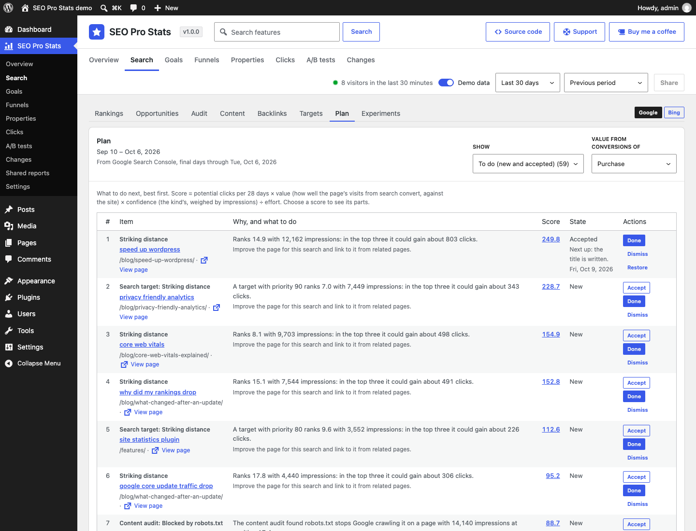
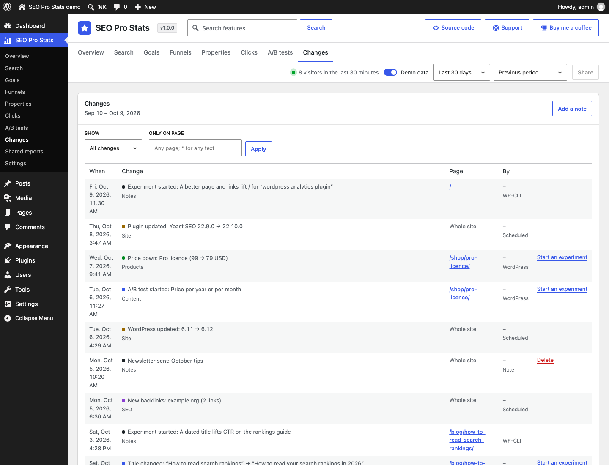
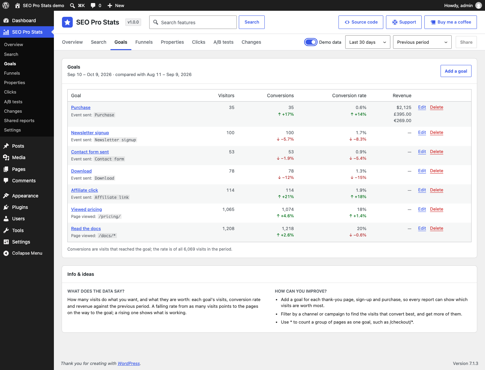
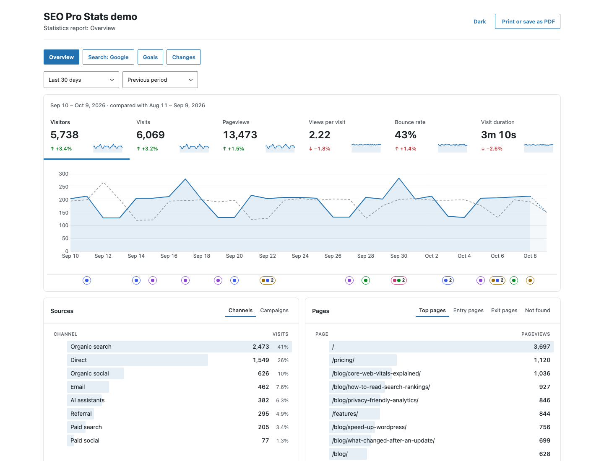

# SEO Pro Stats

<!-- aidevops:badges:start -->
<!-- On GitHub only: the Read Me tab skips this block. scripts/rename-plugin.sh rewrites it. -->
[](https://github.com/wpallstars/seoprostats/actions/workflows/ci.yml)
[](https://sonarcloud.io/summary/new_code?id=wpallstars_seoprostats)
[](https://app.codacy.com/gh/wpallstars/seoprostats/dashboard)
[](https://www.codefactor.io/repository/github/wpallstars/seoprostats)
[](https://scorecard.dev/viewer/?uri=github.com/wpallstars/seoprostats)
[](LICENSE)
[](https://github.com/wpallstars/seoprostats/releases)

[](readme.txt)
[](readme.txt)
[](readme.txt)
[](docs/metrics/repo-metrics.md)
[](docs/metrics/repo-metrics.md)

[](docs/metrics/repo-metrics.md)
<!-- aidevops:badges:end -->

**Actionable analytics for WordPress. Connect your content to the data that shows you how to grow.**

Most statistics plugins count what happened. SEO Pro Stats also shows why, and what to do next. It puts your traffic, search rankings and sales on one timeline with every change made to the site (a post edited, an SEO title rewritten, a price cut, a plugin updated, a Google update rolling out), turns what it finds into a ranked plan of search work, and checks each change you make against the pages you did not change, so you know what worked.

It counts visits in your own WordPress database, with no cookies, no stored IP addresses and no outside service. People read it in wp-admin; scripts and AI agents read the same reports through the REST API, WP-CLI (`wp seoprostats`) and, on WordPress 6.9 and later, abilities.

If this saves you time, headaches and costs, feel free to [buy me a coffee](https://buymeacoffee.com/marcusquinn), or whatever you like, to invest in making more things open-source.

Version: 1.0.0

<!-- github-only:start -->
## Screenshots

**The Overview**: visits against the previous period, the visitors on the site now, and the site's changes marked under the chart.


**Search → Rankings**: Google Search Console and Bing Webmaster Tools clicks, impressions, CTR and position by query and page.


**Search → Plan**: search work from every report in one list, best first, with its score.



**Changes**: what changed on the site, when and on which page.



**Goals**: conversions, conversion rate and revenue per currency, against the previous period, with what the figures say and how to improve them.



**A shared report**: the sections you chose, read-only for a client or colleague, without wp-admin, ready to print or save as PDF.


<!-- github-only:end -->

## Why SEO Pro Stats

- **Cause and effect on one timeline.** The change log records what changed on the site as it is saved (content, SEO titles and descriptions, prices and stock, plugins, themes and settings) with Google's search updates and your own notes, and marks it under every chart. A rise or a drop comes with the changes around it.
- **Your content joined to its results.** Each page's search clicks, position and CTR sit beside the visits from search it started, how long they stayed and how many reached a goal, so you can see which content earns traffic and which earns revenue.
- **A plan, not just a report.** Search → Plan ranks the work worth doing from your own data: striking-distance queries, titles searchers skip, pages losing clicks with the likely cause, words a page is missing, pages competing for one search, audit findings, internal links and pages search does not show. Each item says why it is listed and what to do, with the clicks it could bring, weighted by how well the page converts.
- **Proof of what worked.** Mark a change done and an experiment compares its pages before and after against the pages you did not change, then suggests keep, revise or undo. A/B tests of blocks in the editor compare versions of a page live, without cookies.
- **Private by design.** No cookies or browser storage, no stored IP addresses, no visitor identity across days, and no database query on visitors' pages. Outside services are off until you connect them.
- **Ready for AI agents.** Every report is in the REST API, WP-CLI and WordPress abilities, and the SEO loop export gives an agent one cycle of work: the plan, the experiments due and their results. The plugin proposes and measures; it never changes a page by itself.

## Getting started

1. **Install and activate** SEO Pro Stats, then open it in the admin menu, under Dashboard. Visits show within a minute or two; open the site logged out to make some. Until there are enough, switch on **Demo data** on the Overview to try every report.
2. **Say what counts as a conversion** under **Goals**: a thank-you page, a signup event, a purchase. Paid orders from WooCommerce, Easy Digital Downloads and FluentCart are recorded by themselves; ThriveCart needs its webhook (Settings → Tracking).
3. **Connect your search data** under **Settings → Connections**: Google Search Console and Bing Webmaster Tools, with the 16 months of history they keep.
4. **Bring your history across** from another statistics plugin under **Settings → Import**, so the charts start before SEO Pro Stats did.
5. **Work the plan**: open **Search → Plan**, do the top items, mark each done, and read its result in **Search → Experiments** on its review day.

## What's included

- **Statistics without cookies**: visitors, visits, pageviews, bounce rate and time, sources and campaigns, pages and pages not found, site searches, countries on a map, devices and events, against the previous period. Visits are counted with a hash salted each day; no IP address is stored and visitor pages run no database queries.
- **Goals, Funnels, Properties and Purchases**: conversions and revenue per currency, from pages, events and paid orders in WooCommerce, Easy Digital Downloads, FluentCart and ThriveCart, with refunds and renewals.
- **Clicks**: what people click, dead clicks, links followed, files and forms sent, never what anyone types.
- **Changes**: a log of what changed on the site, search engine updates and your notes, under every chart.
- **Search**: Google Search Console and Bing Webmaster Tools with Rankings, Opportunities, Content, Audit (with internal links, indexation and Google's URL Inspection), Backlinks, Targets, Plan, Experiments, and A/B tests of blocks.
- **Moving from another plugin**: imports history from Burst Statistics, Koko Analytics, Statify, WP Statistics, Independent Analytics, Slimstat, Matomo for WordPress and Jetpack Stats, then removes what it left behind.
- **Shared reports** for clients, **demo data** to try every report, and the same reports for scripts and AI agents through the REST API, WP-CLI and abilities.

## User guide

### Overview

**SEO Pro Stats** in the admin menu, under Dashboard, opens the **Overview**: the visitors in the last 30 minutes (beside the period, refreshed every 30 seconds), then visitors, visits, pageviews, views per visit, bounce rate and visit duration against the previous period, a chart of the one you pick (the day, hour or month still being counted is dotted), where visits came from, what they viewed (with the addresses that were not found, to find broken links), views by author, category and post type, what people searched the site for and which searches found nothing, where (with a world map shaded by visits; choose a country to filter by it) and on what (and whether logged in), and their events with the share of visits that had each. Choose a period and comparison at the top; choose any row to show only those visits, and choose it again (or use the bar above the chart) to remove the filter. Tabs at the top, also in the menu, open the other sections, below.

Under the Overview's chart, a lane marks the changes in the period, coloured by group; changes closer than a marker's width share one with their count. Hover over or focus a marker to list its changes, use the arrow keys to move between them, and choose one to read its changes in a window (close it with Close or Escape), with **Open in Changes** for the same days and page. With the reports filtered to one page, the lane shows that page's changes and the site-wide ones.

At the bottom of each section (and each Search tab), **Info & ideas** answers two questions: **What does the data say?** (how to read the section's figures and what they point to) and **How can you improve?** (three things to do about it). Shared and printed reports leave it out.

Goals and funnels belong to the data you are looking at: demo data has example ones of its own. The period, comparison and filters stay as you move between sections. The address keeps the view, so it can be bookmarked and the back button undoes a change. A **Dashboard widget** shows today so far and the last 7 days; it starts at the top of the right-most column, and stays where you put it once you move a box.

### Search

**Search → Rankings** shows search clicks, impressions, click-through rate (CTR) and average position from Google Search Console (and Bing Webmaster Tools, below) for the period, against the previous one, with a chart of the one you pick (and the changes lane under it), then the search queries, pages, countries and devices, sorted by clicks. Choose a page to list the queries it showed for, or a query to list the pages it showed; choose it again to go back. The period stops at the newest day Search Console has made final (about three days ago), and the comparison has as many days, so days not imported yet never look like a drop. A lower position is better. Until Search Console is connected, it links to Settings → Connections; demo data has made-up search data to try it with. With Bing Webmaster Tools connected too, **Google** and **Bing** buttons at the end of the tabs switch every Search tab to that engine (the address keeps the choice). Bing gives its pages and queries by week and no countries or devices, so with Bing the period is whole weeks ending on Bing's newest week, and a page's or query's chart is by week. With both, a **Combined** button adds them up on Rankings, Opportunities and Content: clicks and impressions summed, CTR and position over both, a query or page shown on both as one row, and the period ending at the earlier of their newest days, in whole weeks (each engine counts its own days: Google's in Pacific time, Bing's in UTC).

**Search → Rankings → Appearance** shows Google Search Console clicks,
impressions, CTR and average position by result type, such as video,
product snippets, review snippets and forums, with the comparison period.
It appears for the whole site and Google only; the address keeps the tab.
One search can show several appearances, so these figures do not add up
to the site's totals. New types returned by Google are imported too.
Imports resume in the background and can be undone; demo data includes
made-up appearance days. Scripts and AI agents use REST `search?kind=appearance`,
`wp seoprostats search appearance --data=demo --range=30d --compare=prev --format=json`,
or the `seoprostats/search` ability with `kind: appearance`.

**Search → Rankings → Days** lists the chart's points as a table, newest
first: clicks, impressions, CTR and average position for each day, or each
week or month when the chart shows those. It works for Google, Bing and
Combined, and for one page or one query; Newer and Older page through long
periods. The comparison stays on the totals, not on each row. Scripts and AI
agents use REST `search?kind=days` (each row has `from` and `to`),
`wp seoprostats search days --range=90d --limit=100 --format=csv`, or the
`seoprostats/search` ability with `kind: days`; `offset` reads the next rows.

#### Opportunities

**Opportunities**, beside Rankings, says where search work pays:

- **Striking distance**: a page's queries at positions 4–20, with the clicks each could gain in the top three, at the CTR this site gets there.
- **Low CTR**: queries in the top 10 that searchers choose much less often than this site's own CTR at that position; a clearer title and description may win the missed clicks.
- **Losing clicks**: pages with at least a fifth fewer clicks than the earlier period, each with the likely cause (it ranks lower, it is searched for less, fewer searchers choose it, or it is no longer shown), the queries that lost most and what changed on the page, plus the search engine updates in the two periods.
- **Missing from the page**: queries a page ranks for in the top 20 whose words the page does not have, or has only some of, with the words missing; questions are marked.
- **Overlapping pages**: queries for which two or more pages each get at least a tenth of the impressions, with each page's share, position and clicks, and whether the page with most impressions changed between the halves of the period. These are candidates to review, not faults: a guide and a product page can both be right for one search. If the pages answer the same need, make one the clear answer and link to it from the others.

Choose a row to open it in Rankings. Expected CTR is measured from the site's own search data, with a cautious default where it has too few impressions; at most the newest 91 days of the period are read.

#### Audit

**Audit**, after Opportunities, checks what WordPress says about each published page: its title and description (your SEO plugin's, or the post's own title and excerpt), its headings, length and images, and whether it asks search engines not to index it or names another page as canonical. It lists the pages with a finding, most search impressions first, so the fixes that matter most are at the top: a title over 60 characters, missing or the same as another page's; a description over 160 characters, missing or shared; no H1 or several (themes show the title as one); images without alt text; thin content (under 300 words, shown in search but never clicked); and noindex or a canonical address elsewhere on a page that still shows in search. Pick a finding to list only those pages. Pages are read when they are saved, and the rest in a daily batch of 200 (each again within 30 days), never while visitors browse. Titles, descriptions, noindex and canonical come from Rank Math, Yoast SEO, SEOPress or All in One SEO when one is active.

Under the findings, **Internal links** reads the links in each page's text to the site's other pages, at the same time as its other facts, and lists three things to fix: **orphan pages** that no other page links to, most search impressions first; **converting pages with few links in**, whose visits from search reach the goal you pick 3 or more times but which 2 or fewer pages link to (the front page is in neither list, as menus link to it); and **missing links**, where a page shows for a search but does not link to the page that gets most of that search's clicks, with the searches and both pages' figures. Only links in the text count, not menus or widgets.

Below that, **Indexation** lists what search does not seem to show: **published pages** with no search impressions in the newest 28 days of search data, published before them (noindex pages and pages whose canonical is elsewhere are left out), and **other sitemap addresses**, the category, tag and author archives and other plugins' addresses in WordPress's own sitemap, listed that long with none. Each row says whether search never showed it or showed it before and when it stopped, with its age, words and links in. The sitemap is read once a day from WordPress, with no outside request; when an SEO plugin replaces WordPress's sitemap, only published pages are listed. With Google Search Console connected, each row also gives Google's own reason (such as "Crawled - currently not indexed") and its last crawl.

Last, **Google's index** (Search Console only) shows the sitemaps submitted in Search Console as Google read them, with their errors, warnings and when Google last downloaded each, and warns when the site's own sitemap is not submitted; and the pages Google's URL Inspection has checked, newest first, with Google's verdict, reason, last crawl and a link to the inspection in Search Console. The hourly import inspects up to 200 pages a day (Settings → Data → Google URL inspections, 0 to 2,000, Google's own limit): first those Indexation lists, then pages with search traffic, each again after 14 days. Four audit findings come from it: **blocked by robots.txt**, **crawled, not indexed**, **Google picked another canonical** and **rich result errors**; sitemap problems go to Plan.

#### Content

**Content**, after Audit, sets each page's search clicks, position and CTR beside the visits from search that started on it (from any search engine, so the two differ), their bounce rate and time, and how many reached a goal (pick which; the first by default). A page that ranks but whose visits leave needs better content or a clearer next step; one that converts but gets few clicks is worth ranking higher. Sort by clicks, visits or conversions; choose a page to open it in Rankings. The visits come from the daily summaries; after an update, older days are added in the background within minutes.

#### Backlinks

**Backlinks**, after Content, lists pages of other sites that link to yours, found without an outside service: once a day the site opens the pages that sent visitors (often only the other site's home page, as browsers usually send just its address) for up to 20 seconds and keeps their links to your pages, with the link text and whether they are nofollow, sponsored or ugc. Four lists: **links** (newest first), **sites linking** (with their visits in the period), **pages linked to** and **lost links**. Each page is checked again weekly; a link missing on two checks in a row, or on a page that is gone, is lost. New and lost links show on the timeline. Links from sites that never sent a visitor are not found. Switch it off under Settings → Data → Check pages that send visitors for links.

#### Targets

**Targets**, before Plan, lists the searches you chose to win and the page meant for each, highest priority first: its position, clicks and impressions on any page, the page search shows most for it, and whether that is the page meant for it (**Ranking with its page**), another page (**Another page ranks**), no page chosen yet, or not shown at all. Administrators **Import targets** by pasting a list: one search a row with its page (a path such as `/pricing/` or an address on this site), priority (0–100, or high, medium, low) and status (candidate, targeted, live, won, retired), as CSV or tab-separated text, JSON, or the aidevops search targets table. A row that cannot be read (no search, an address on another site, a priority or status it does not know, the same search twice) is skipped and listed with its reason, never guessed. Plan lists each open target (candidate, targeted, live) where another page ranks, and each with priority 70 or more in positions 4–20, weighted by its priority.

#### Plan

**Plan**, before Experiments, puts what Opportunities, Audit, Internal links and Indexation find into one list of what to do next, best first. Each item names its page (and query), says why it is listed and what to do, and shows its score: the clicks it could bring per 28 days × the page's value (how well its visits from search convert against the site, for the goal you pick; 1 without goals) × confidence (lower for kinds that are harder to predict and for few impressions) ÷ effort; choose a score to see its parts. Administrators **Accept** an item, mark it **Done** once the change is live (that starts an experiment on the page with the item's measure, and the item then shows its result), **Dismiss** it (it comes back after 90 days if still found) or **Restore** it, and can set its effort (1–5) and a note. Pages with an experiment running get no new items, so a second change does not spoil the measurement. Only items someone acted on are stored.

For a page losing clicks, Plan proposes what to do rather than only saying it lost them: **Update** it (it ranks lower or is chosen less; what to do depends on whether its content is old or changed while it lost clicks), **Leave** it (fewer people search and it still ranks where it did; Done starts no experiment), **Protect** it (its visits from search convert at twice the site's rate or more: change it carefully) or **Merge** it (another page of the site overtook it for a search it lost: make one page the clear answer). Each says why, with the clicks lost, the content's age and words, its conversions and the other page's positions. Nothing changes the page by itself. Opportunities → losing clicks shows which page overtook each search.

#### Experiments

**Experiments**, the last tab, checks whether a change worked. Write down a change and what it should do (more clicks, a better position, more visits from search or conversions) before the result is known: from a row in **Changes** (**Start an experiment** fills in the change and its page) or with a start time and pages. It compares the same number of days before and after the change (7 to 84, whole weeks; the change day left out) for its pages and for the pages that did not change, so a site-wide rise or a season does not count as an effect, and says how far unchanged pages usually move by themselves, whether there was enough data, and what else happened: search engine updates, site-wide changes and other changes to its pages. Once the data reaches the review day it suggests **Keep**, **Revise**, **Undo** or **Inconclusive**; you decide, with a note, and the decision keeps the figures it was made on. Due ones come first. A result is evidence about this site, not proof of cause.

#### In the post editor

While you edit a post, a **Search queries** panel (the block editor's sidebar, or a box in the classic editor) shows the same check for that post: the share of its search impressions on queries it covers, its SEO plugin's focus keywords (Rank Math, Yoast SEO, SEOPress or All in One SEO) with their clicks and position, the queries not covered yet with the words missing, and the questions people searched. It re-checks as you write. Without an SEO plugin it works the same, less the focus keywords.

### A/B tests

In the block editor, select a block (a paragraph, a button, a group…) or
several and choose **A/B test** in the block toolbar or its More menu.
The selection becomes Variant A of a test and Variant B starts as a copy
to change. The test's toolbar has a variant dropdown to pick the variant
shown and edited; the others stay saved. The block's sidebar sets the
test's name, status (draft, running, paused, ended) and the goals it is
judged by, and each variant's label and weight (equal by default), and adds,
duplicates, removes and reorders variants (up to ten). Tests start in posts
and pages; templates, template parts and synced patterns come later.

Once a test is running, each page load shows one variant, picked by
weight in the browser before the page is drawn, so there is no flicker
and nothing is stored: no cookie or browser storage. Search engines,
visitors without JavaScript, feeds and page caches see Variant A (or the
winner). Draft, paused and ended tests show Variant A or the winner only.
Saving a post keeps a list of its tests; a test taken out of a post is
kept as removed, so its results stay.

Each pageview records the variants it showed, and clicks inside a
variant count for it. **SEO Pro Stats → A/B tests** lists every test with
its visits per variant and its leader; open one to see its variants side
by side over the test's whole life: visits, conversions and rate on its
first goal (or, without goals, visits that clicked inside the variant),
the uplift over Variant A with a 95% interval, the chance to beat it, and
every goal with revenue, bounce rate, engaged time and clicks. A variant
is called better or worse at a 95% chance, once each side has 100 visits,
the two have 10 conversions and the test has run 7 days; before that the
test says it is too early. A visit that saw more than one variant (when
each page load picks again) is counted apart, in no variant. Choosing a
variant filters every report by it (the **A/B variant** filter), the
Overview's Events card has an A/B variants tab, the Pages card marks pages
with a running test, and starting, pausing, ending a test or picking its
winner shows on the timeline. Scripts and agents read the same from `GET
/ab-tests`, `GET /ab-tests/{id}`, `wp seoprostats ab-tests [<id>]` and the
`seoprostats/ab-tests` ability.

The test's sidebar in the editor shows its results when you open it:
each variant's visits, conversion rate and chance to beat Variant A, a
one-line verdict (or what it still needs before it can be called), and a
link to the test in **A/B tests**. **Pick a winner** replaces the test
with the variant you choose (the leader, when there is one), in one step
you can undo. When you save the post, the test ends with that winner,
which shows on the timeline; its results stay in A/B tests, and the page
prints only the winner's blocks, with no test script. Undo before saving
and nothing changes.

To show
a visitor the same variant on every page of a visit, turn on **Settings →
Tracking → Show each visit one variant of an A/B test** (off by default).
It keeps the variant in the browser tab's session storage until the tab is
closed. Privacy law treats browser storage like cookies, so this may need
your visitors' consent.
While SEO Pro Stats is switched off, a page shows all of a test's
variants one after another.

A/B tests are not Search → Experiments, which measure a change you made
to pages against pages you did not change.

### Goals, Funnels and Properties

- **Goals**: pages viewed or events sent that count as conversions, with the visits that reached each, the conversion rate and revenue (per currency, never added across currencies). Administrators add, change and delete them; pages and events from the last 90 days are suggested as you type, and `*` matches any text (`/blog/*`).
- **Funnels**: 2 to 12 steps, pages or events, reached in order within one visit, with how many visits reached each step and how many left before the next.
- **Properties**: the properties sent with events and pages (a plan, an author), how often, and, for one property, its values with the revenue of the events that carried them.

### Clicks

**Clicks**: what people click and the forms they send, on the whole site or one page: clicks, dead clicks (nothing happened, usually something that looks clickable but is not), link destinations (outbound and affiliate marked), file links and forms, against the previous period. Choose a total to list its rows. **Pages** lists where clicks happened, with dead-click rates, link clicks, forms sent and visits. Choose a page to narrow this section, and choose it again to clear it. **View page** opens its address; **Edit** appears only when you can edit the matching post. A page pattern (`*`) has no View or Edit links.

### Changes

**Changes**: the change log for the period, newest first: what changed, when, on which page and by whom, for the whole site or one page (with the site-wide changes), and for one group (content, SEO, products, site, search engines or notes). Choose a page to see its statistics; a search engine update links to its source. Administrators add notes for what the log cannot see, such as a newsletter sent or a sale, and delete them.

**Search engine updates** (off until you switch them on under Settings → Data): Google's ranking updates (core, spam, reviews and others) and its crawling, indexing and serving incidents show in the lane, with a bar for how long each rolled out, and in Changes. Once a day the site asks Google's [Search Status Dashboard](https://status.search.google.com) for them, one request that sends nothing about the site or its visitors; the first time, it adds the past updates the dashboard still lists. Add other sources you trust, such as a search engine's blog, as RSS, Atom or JSON Feed addresses under **Other feeds**; their posts whose title names an update are added too. For Bing, add its Search blog, `https://blogs.bing.com/search/feed/ Bing`: Bing announces few updates there, and its product news is left out.

### Shared reports

Administrators can choose **Share** after the period controls on any tab,
or open **Shared reports** in the menu. A report has one or more sections
in the order the reader should see them: Overview, Search (once for each
engine: Rankings, Opportunities, Audit and Content, never the Targets,
Plan or Experiments), Goals, Funnels, Properties, Clicks and Changes, each section
once. A new report starts with every section that has data, the tab you
were on first; remove any, or drag them into order by their handles (or
with the keyboard: Tab to a handle, Space, the arrow keys, Space again;
Escape cancels). Add an optional note, password and expiry, and edit a report later
from the list. Starting filters can be locked on every section; readers
may add filters, change period and comparison, and switch tabs but cannot
remove the server's locks. Search data and the change log have no visits,
so a report with Search or Changes can lock pages only. An optional limit
on the days readers can look back also covers the comparison period.

Copy the private link when it is first shown: only its hash is stored.
If lost, **Make a new link** gives another and invalidates the old one.
**Revoke** stops access immediately. Anyone with an unprotected link can
read its reports, so use a password when appropriate and keep links private.
Password unlocks last an hour in the tab's session storage, not a cookie.

The reader sees a standalone report, without wp-admin, the theme or a
tracker. It is not indexed and cannot be cached publicly. Reports use live
data only, never demo data, editors, settings or user information. Hide
search terms and referrer addresses when sharing outside the business.
Realtime is omitted for locked shares because its existing report is
site-wide. Chart markers and the Changes section contain only the change
kind, time and allowed page, with a published page's title or a search
engine update's name, never names of users, plugins or themes,
configuration or before-and-after values, or private notes; visit filters
such as a campaign or country omit changes. Printed reports list the
period's changes by date under the charts.

Set defaults for new reports under **Settings → Shared reports**: **Agency
branding** (agency name, website, byline and a Media Library logo, at the
foot of the report), **Report colours** (an accent picked from the site's
theme, Site Editor or Customizer colours, or any other, and whether the
report opens light, dark or following the reader's device) and the
"Statistics logged by SEO Pro Stats for WordPress" credit. Each report can
override them: title, local Media Library logo IDs, agency name, website,
byline, accent, appearance and credit. Otherwise the header uses the
site's logo, Site Icon and site name. Readers can switch between light and
dark; an accent too light or too dark for AA text contrast on the page is
darkened or lightened in its own hue until it is readable.
**Share** sits after the period controls; with demo data it shows but
cannot be pressed, as only live statistics are shared. **Print or save as
PDF** (or the browser's own print shortcut) first asks which sections to
print, then prints each with all of its tabs, one section per page start,
for the period on screen, through the browser's print dialog as a clean
branded report. Breakdowns a report hides (search terms and referrer
addresses) show no tab.

Scripts manage shares through `/shares` (administrators) or
`wp seoprostats share list|create|revoke|renew --user=<administrator>`.
Public reports have separate read-only `/share/{token}/{section}/{report}`
routes; their credentials cannot authorize the ordinary report API.

### Settings

Go to **SEO Pro Stats → Settings** for the settings. The screen has two groups of tabs:

- **Settings**: Shared reports, Tracking, Privacy, Data, Connections and Import. Changes save instantly; there is no Save button. **Search features** (next to the plugin name) finds settings on every tab.
- **About**: this Read Me.

At the top right of the screen, **Source code** opens the plugin’s [GitHub repository](https://github.com/wpallstars/seoprostats) in a new tab, and **Support** opens its [GitHub issues](https://github.com/wpallstars/seoprostats/issues) in a new tab. Say what you did, what you expected and what happened, with the versions of WordPress, PHP and SEO Pro Stats. Leave out passwords, licence keys and personal data, since issues are public. For questions, ask [aidevops](https://aidevops.sh) (Built with AI below). **Buy me a coffee**, next to it, opens the maker’s [Buy Me a Coffee](https://buymeacoffee.com/marcusquinn) page in a new tab.

### Connecting Google Search Console and Bing

**Google Search Console** (off until you connect it under Settings → Connections): clicks, impressions and average position for each page and search query, by day, kept with the visits so search and traffic can sit on one timeline. It connects through a Google Cloud service account, set up once while signed in to Google as an owner of the site's Search Console property (the Connections tab shows the same steps, with the links):

1. **Make a Google Cloud project**: [Create a project](https://console.cloud.google.com/projectcreate), give it any name and choose Create. A project you already have works too.
2. **Turn on the Search Console API**: open the [Google Search Console API](https://console.cloud.google.com/apis/library/searchconsole.googleapis.com), check your project is chosen at the top, and choose Enable.
3. **Make a service account**: [Service accounts](https://console.cloud.google.com/iam-admin/serviceaccounts) → Create service account. Name it, choose Create and continue, then Done (it needs no roles or access). Copy its email address, which ends in `iam.gserviceaccount.com`.
4. **Download its key**: choose its email address → Keys → Add key → Create new key → JSON → Create. Your browser downloads a `.json` file; keep it private ([about keys](https://docs.cloud.google.com/iam/docs/creating-managing-service-account-keys)).
5. **Let it read the site in Search Console**: [Users and permissions](https://search.google.com/search-console/users), choose the site's property at the top left, then Add user. Paste the service account's address, choose Restricted (it only reads) and Add ([help](https://support.google.com/webmasters/answer/7687615)).
6. **Connect**: open the key file in a text editor, copy all of it, paste it on the Connections tab and choose Connect.

If Google says key creation is turned off by an organisation policy, make the project with Location: No organization, or ask the organisation's administrator to allow keys for it.

The key is stored encrypted and never shown again. On connecting, the 16 months Search Console keeps are imported in the background, newest first; after that each day is added once Search Console marks its figures final, about three days later. **Import now** fetches what is ready; each import is listed and can be undone. Disconnecting stops the imports and keeps the data unless you also delete it. Search data by page and query is kept 25 months (Settings → Data); daily totals are kept.

**Bing Webmaster Tools** (off until you connect it under Settings → Connections): Bing's clicks and impressions for the site by day, and its top pages and search queries by week with their average position, beside Google's. It needs only an API key, no Cloud project:

1. **Add the site to Bing**: open [Bing Webmaster Tools](https://www.bing.com/webmasters/) and sign in. If the site is not there yet, add it; importing it from Google Search Console verifies it at once.
2. **Copy the API key**: Settings (top right) → API access → API key; generate one if there is none, and copy it ([help](https://learn.microsoft.com/en-us/bingwebmaster/getting-access)). One key reads every verified site of the account.
3. **Connect**: paste it on the Connections tab and choose Connect. The site matching this one is chosen; choose another from the list if needed.

The key is stored encrypted and never shown again. On connecting, the 16 months Bing keeps are imported in the background; after that each week is added once Bing gives it, about a week after it ends, then the search queries of the 300 pages with most clicks (one request each). A day's position is its week's average. Imports are listed and can be undone, as Search Console's.

### Moving from another statistics plugin

**Moving from another statistics plugin** (SEO Pro Stats → Settings → **Import**): bring its history across, so the charts start before SEO Pro Stats was installed. It reads Burst Statistics, Koko Analytics, Statify, WP Statistics, Independent Analytics, Slimstat, Matomo for WordPress and Jetpack Stats, each for what it kept: Burst has visits, bounces, time, campaigns, countries, devices and browsers; Koko Analytics has visitors and pageviews of the site and its pages, and referrers; Statify has only pageviews of the site, its pages and referrers, for the days it still keeps; WP Statistics has a row per visitor and day (imported as one visit each) with its pages, referrer, campaign, country, device and browser, and daily totals for days it purged; Independent Analytics has visits and pageviews with time on page, campaigns (Pro), countries, devices and browsers; Slimstat and Matomo for WordPress keep a row per pageview or visit, often millions, read one day at a time on their time index (each visit counted as one visitor; Matomo keeps only the campaign's name and keyword), and the dry run estimates large tables' counts from a few days; Jetpack Stats keeps its history on WordPress.com, which gives daily views and visitors (each visitor's day imported as one visit) and per day the views of posts and pages, referrers and countries, fetched in the background and in WP-CLI only, while Jetpack is active and connected (the tab says when it needs connecting or updating; `wp seoprostats migrate run jetpack --dry-run --requests` shows each request for problem reports; the import is new, built from Jetpack's published code). What a plugin did not keep stays empty for its days (no visits are made up), and pages per visit counts only days with visits. The tab lists it whenever its data is on the site, whether it is active, switched off or deleted with its data left, with its first and last day.

1. **Check what would be imported**: the days, the days skipped and why, its own counts, the rows per report, and the settings it would fill in. Nothing changes.
2. **Import**: it runs in the background, a day at a time, and the tab shows how far it is. Each day comes from one place: SEO Pro Stats's own days are never replaced (on its first day it counts only from when it started), and a day another import filled is skipped, so importing again adds nothing. When two plugins have statistics for the same days, choose which fills them. Only settings still at their default are filled in, and the other plugin's own settings are never changed.
3. **Check the days**: the finished import shows the plugin's own pageviews and visits beside the imported ones, with a link to the Overview for those days and a note on the timeline. **Undo** deletes exactly the days it added.
4. **Switch the old plugin off and delete it**, then **Remove leftover data**: it lists exactly the tables, options, scheduled tasks and files the plugin left on the site and deletes them once you confirm. It is refused while that plugin is active and cannot be undone, so back up the database first. Imported days stay.

Only counts are read: no IP addresses, visitor IDs or browser strings leave the other plugin's tables.

Until the old plugin and its data are gone, the next step shows at the top of the Plugins screen and of SEO Pro Stats's screens, and under the plugin's row: **Import its history** while it has days not imported yet; then check the import and **Deactivate** it (naming its own delete-data setting when it has one); then **Delete** it and **Remove leftover data**. **Hide** hides that step for you until the next one. Both plugins keep counting meanwhile, and the screens never read the other plugin's tables: SEO Pro Stats looks in the background when plugins change, and once a day.

## Privacy

No cookies or browser storage, no stored IP addresses and no visitor identity across days: visits are counted with a hash salted each day. Do Not Track and Global Privacy Control are respected. Clicks and site searches hide email addresses and long numbers, and what people type in forms is never recorded. Visitor pages run no database queries, and reports read daily summaries.

Outside services are off until you switch them on or connect them (Google Search Console, Bing Webmaster Tools, Google's search updates, Jetpack Stats while importing it), except the daily check of pages that sent visitors for their links, which sends nothing about visitors and can be switched off under Settings → Data. `readme.txt` → External services lists each one with what it sends.

## Requirements

- WordPress 6.2 or later
- PHP 7.4 or later

## Updates

There are two builds of each version:

- **GitHub release** (`seoprostats-X.Y.Z.zip` on the repository's Releases page): everything, including a small updater in `includes/github-updater/`, so sites get each release as a normal WordPress update. Its main file also gets an `Update URI` header on github.com, so WordPress.org never offers a plugin of the same name in its place. The updater waits while Git Updater is active, so the two never both update the plugin.
- **WordPress.org**: the same plugin without the updater and its header lines, as plugins hosted there may not install or update code from elsewhere, and with plain links in place of affiliate links (those listed in `.wporg-links`).

GitHub gets each version first, as the stable beta channel; WordPress.org gets it 30 days later, once it has been used on real sites, except security releases, which go there at once. Sites offer an update when they next check (within 12 hours, or at once with **Check again** on the Updates screen) and never offer pre-releases.

Maintainers build, check and publish releases with `RELEASING.md`.

## Developers and AI agents

### Statistics for scripts and AI agents

The REST API (`/wp-json/seoprostats/v1`) and WP-CLI give the same numbers as the dashboard, from one report engine (`includes/stats/class-seoprostats-query.php`). The contract is `docs/api/openapi.yaml`; metric definitions are in `docs/architecture.md` → Reports.

- Routes: `stats` (headline metrics), `timeseries`, `breakdown` (top values of a dimension), `realtime` (the last 30 minutes), `markers` and `changes` (the change log, below), `goals`, `funnels`, `properties` (keys, or with `key` its values; `event` for one event's), `clicks` (totals, and with `kind` the clicked `elements`, `dead` clicks, `links`, `downloads`, `forms` or `pages`; `page` for one page's) and `search` (search totals of one `engine`, `google` by default or `bing`, or `all` for every engine with data added up, with `engines` listing those with data; daily points and, with `kind`, `queries`, `pages`, `countries` or `devices`; `page` for one page's queries, `query` for one query's pages; the period ends at `through`, the newest day with search data, and only page filters apply, others are listed in `ignored`) and `opportunities` (`kind` `striking`, `ctr` or `decay`, as above, with the thresholds used in `rules`, the site's CTR by position in `curve`, and for `decay` each page's `cause`, `why`, `queries` and `changes` and the search engine `updates`, and `missing` for queries their page does not cover; at most the newest 91 days are read) and `coverage` (one page's Google queries, by `page` or `post`, each with `match` (`title`, `heading`, `text`, `partial` or `none`), the words `missing`, `phrase` and `question`, the SEO plugin's `focus` keywords and `totals`) and `content` (per page, search figures with the visits from search that started on it and their conversions of `goal`, the first goal when left out; `sort` `clicks`, `visits` or `conversions`, `limit` and `offset`; `partial` while older days of visits from search are still being filled in). `POST /goals`, `PUT` and `DELETE /goals/{id}` (and the same for funnels) change them, and `POST /annotations` and `DELETE /annotations/{id}` add and delete notes; that needs `manage_options`. Parameters: `range` (`today`, `7d`, `30d`, `month`, `12mo`, `all`, `custom` with `from` and `to`, and more), `compare` (`prev` or `year`), `filters`, and for breakdowns `dimension`, `limit` and `offset`.
- Filters are `dimension:operator:value`: operators `is`, `is_not`, `contains` and `matches` (`*` is any text); a comma means any of, and separate filters must all match. For example `channel:is:organic_search,ai` or `page:matches:/blog/*`.
- Reading needs the `view_seoprostats` capability, which people who can manage options have, and the roles allowed under Settings → Data; change the capabilities it needs with the `seoprostats_view_caps` filter. Scripts and agents sign in with an Application Password (Users → Profile).
- WP-CLI: `wp seoprostats stats --range=30d --compare=prev`, `wp seoprostats breakdown page --filter="channel:is:organic_search"`, `wp seoprostats timeseries`, `wp seoprostats realtime`, `wp seoprostats goals` (and `goals add --name="Purchase" --kind=event --match=Purchase`, `list`, `update <id>`, `delete <id>`), `wp seoprostats funnels` (`funnels add --name=Checkout --steps="page:/pricing/;page:/cart/;event:Purchase"`), `wp seoprostats properties [<key>] [--event=<name>]`, `wp seoprostats clicks [elements|dead|links|downloads|forms|pages] [--page=<path>]`, `wp seoprostats search [queries|pages|countries|devices] [--page=<path>] [--query=<query>]`, `wp seoprostats opportunities [striking|ctr|decay|missing]`, `wp seoprostats coverage <path|post-id> [--missing] [--questions]`, `wp seoprostats audit [list|run] [--finding=<finding>]` (`run` reads the next posts' facts now), `wp seoprostats links [--kind=orphans|converting|missing] [--goal=<id>]`, `wp seoprostats indexation [list|run] [--kind=pages|sitemap] [--days=<n>]` (`run` reads the sitemap now), `wp seoprostats inspect [<page>] [--run] [--sitemaps] [--verdict=<verdict>] [--finding=<finding>]` (Google's URL Inspection; `--run` inspects the pages due now within the daily cap, `--sitemaps` lists Search Console's sitemaps and `--sitemaps --run` reads them now), `wp seoprostats backlinks [links|domains|pages|lost|check] [--all]` (`check` opens the pages that sent visits that are due now, even with the setting off; `--all` opens every one), `wp seoprostats content [--sort=clicks|visits|conversions] [--goal=<id>]`, `wp seoprostats process` (process waiting hits now), `wp seoprostats rollup` (summarise finished days now, or rebuild days with `--from` and `--to`), `wp seoprostats prune` (delete data past its retention now; `--dry-run` counts it), `wp seoprostats purge-caches` (purge the known page caches now) and `wp seoprostats doctor` (checks tables, collector, salts, cron, waiting hits, daily summaries and the last page cache purge). Add `--format=json` for the full answer.
- Change log: what changed on the site, when and on which page, recorded as it is saved (never on visitors' pages) and kept for good: posts and pages published, unpublished (draft, private, bin, deleted), moved to a new address, retitled and edited (words added and removed, internal links added, removed or reworded, external sites gained and lost); the SEO title, meta description, robots and canonical of Yoast SEO, Rank Math, SEOPress and The SEO Framework; WooCommerce prices up and down, sales started and ended, out of stock and back, coupons published, changed and removed, and Easy Digital Downloads prices; plugins installed, updated, activated, deactivated and deleted, themes switched and updated, WordPress updated; and the search engine visibility, permalink, site address and front page settings; and, when switched on, search engine updates (kind `search_update`, group `search`: `old` is the type, such as `core` or `spam`, and `meta` has `name`, `engine`, `url` and, for rollouts, `ended`, empty while rolling out). `GET /markers` gives a range's changes oldest first, for charts, with the updates still rolling out from before it, and `GET /changes` newest first with `limit` and `offset`; both take `page` (that page's changes and the site-wide ones) and `kinds` (kinds such as `price_down` or groups `content`, `seo`, `product`, `site`, `search`, `note`). Each has a one-line `label`, the page `path`, `old` and `new` values and details in `meta`. WP-CLI: `wp seoprostats changes [--page=<path>] [--kind=<kinds>] [--range=90d]`, and `wp seoprostats search-updates fetch` (fetch search engine updates now) or `status` (each source's last answer; `doctor` shows failures too). The `seoprostats_record_change` filter changes or drops one before it is recorded. Imports, autosaves, revisions and private post types are left out.
- Notes (annotations): what the change log cannot see, such as a newsletter sent, a sale or a move to a new host, on the timeline with the changes (group and kind `note`). `POST /annotations` with `note` (up to 190 characters), optional `page` and `time` (site time zone, `2026-10-05 14:30`; default now); `DELETE /annotations/{id}` deletes a note (recorded changes cannot be deleted). WP-CLI: `wp seoprostats annotate "Newsletter sent" [--page=<path>] [--time=<when>]` and `wp seoprostats annotate --delete=<id>`.
- Abilities (WordPress 6.9 and later): `seoprostats/markers` (the changes in a period, for anyone who may read the statistics), `seoprostats/search` (the Search report: `range`, `from`, `to`, `compare`, `kind`, `page`, `query`, `limit` and `data`, for anyone who may read the statistics), `seoprostats/opportunities` (search opportunities: `kind`, `range`, `from`, `to`, `compare`, `limit` and `data`, for anyone who may read the statistics), `seoprostats/audit` (the content audit: `finding`, `engine`, `range`, `from`, `to`, `limit`, `offset` and `data`, for anyone who may read the statistics), `seoprostats/links` (internal links: `kind`, `goal`, `engine`, `range`, `from`, `to`, `limit`, `offset` and `data`, for anyone who may read the statistics), `seoprostats/indexation` (pages and sitemap addresses search has not shown: `kind`, `days`, `engine`, `limit`, `offset` and `data`, for anyone who may read the statistics), `seoprostats/inspections` (Google's URL Inspection of the site's pages with Search Console's sitemaps: `page`, `verdict`, `coverage`, `finding`, `limit`, `offset` and `data`, for anyone who may read the statistics), `seoprostats/backlinks` (pages of other sites linking to the site's: `kind`, `range`, `from`, `to`, `limit`, `offset` and `data`, for anyone who may read the statistics), `seoprostats/coverage` (one page's queries and how its words cover them, its questions and focus keywords: `page` or `post`, `range`, `from`, `to` and `data`, for anyone who may read the statistics), `seoprostats/content` (each page's search figures, visits from search and conversions: `sort`, `goal`, `range`, `from`, `to`, `compare`, `limit` and `data`, for anyone who may read the statistics) and `seoprostats/annotate` (add a note, administrators), in the Site statistics category and under `wp-abilities/v1`, for AI agents and MCP clients.
- The SEO loop for agents: `GET /loop` (`wp seoprostats loop --format=json`, ability `seoprostats/loop`) is one answer per cycle: the decision queue's open items, the experiments due for review, running and decided in the last 90 days with their results, and the period's search figures per query and page in the aidevops export layout (`query`, `page`, `clicks`, `impressions`, `ctr`, `position`); `params` holds the period, engine and goal to use when acting on an item. `wp seoprostats loop --format=toon` writes those rows as an aidevops export file. The steps an agent follows (read, accept, change, mark done, decide on the review day, carry results into the next plan) are in `docs/seo-loop-recipes.md`.
- Search Console (administrators who may change the settings): `GET /connections` lists each source's status (never its key), `POST /connections/search-console` with `key` (the JSON key's text) and optional `property` (`sc-domain:example.com` or `https://example.com/`) connects it, `DELETE /connections/search-console` disconnects it (`delete_data=true` also deletes its data), `POST /connections/search-console/import` imports now, and `DELETE /imports/{id}` undoes an import. When the service account cannot read a property, the error lists those it can. WP-CLI: `wp seoprostats connect search-console --key-file=key.json [--property=<property>]` (`--key-file=-` reads standard input), `wp seoprostats disconnect search-console [--delete-data]`, and `wp seoprostats search-console status`, `import` (until every final day is in), `imports`, `undo --id=<id>` and `reimport --from=<day> --to=<day>`. Define `SEOPROSTATS_ENCRYPTION_KEY` in `wp-config.php` to encrypt keys with your own secret rather than the site's security keys; changing either means connecting again. `seoprostats_search_import_limits` sets the most rows imported per day (`pages` 5,000, `queries` 5,000, `pairs` 10,000, the top by clicks).
- Bing Webmaster Tools: the same routes with `bing` for the source (`key` is the API key, `property` the verified site, such as `https://example.com/`), and `wp seoprostats connect bing --key-file=<file>` (`-` reads standard input), `wp seoprostats disconnect bing` and `wp seoprostats bing status|import|imports|undo|reimport`. `search`, `opportunities` and `content` (REST, WP-CLI `--engine=bing` and the abilities' `engine`) answer for Bing; its pages and queries are weekly, stored on each week's last day, so its periods are widened at the start to whole weeks and a page's or query's `grain` is `week`. `engine=all` (`--engine=all`), Combined, adds up every engine with data on those three: its period ends at the earliest of their newest days, in whole weeks with Bing, a page's or query's `grain` is `week`, and it has no countries or devices; while only one engine has data it answers as that one.
- Moving from other statistics plugins (administrators who may change the settings): `GET /migrate` lists the plugins whose data is on the site (`fresh=true` looks again), the import job and the imports with their check; `POST /migrate/{source}` with `dry_run=true` is the dry run, without it starts an import (`prefer` names the plugin that fills days two plugins share, `from` and `to` limit the days, `settings` lists the setting keys from the dry run to carry over: an empty list carries none, and without it every one the dry run would change); `DELETE /imports/{id}` undoes one; `POST /migrate/{source}/cleanup` lists what the plugin left behind, and with `dry_run=false` removes it (refused while it is active; needs the rights to delete plugins and manage options). WP-CLI: `wp seoprostats migrate list`, `run <source> [--dry-run] [--requests] [--prefer=<source>] [--from=<day>] [--to=<day>] [--settings=<keys>|none]` (to the end; `--requests` lists the adapter's requests; `--settings` takes comma-separated keys from the dry run), `imports`, `undo --id=<id>` and `cleanup <source> [--dry-run] [--yes]`. Abilities: `seoprostats/migrate` (plugins found, dry run, leftovers) and `seoprostats/migrate-import`; removing leftovers has no ability. The sources are `burst-statistics`, `koko-analytics`, `statify`, `wp-statistics`, `independent` (Independent Analytics), `slimstat`, `matomo` (Matomo for WordPress) and `jetpack` (Jetpack Stats); a plugin's `unavailable` says why it cannot be imported now (Jetpack: connect it first), and a running job's `notice` and `wait` say why and until when it waits for a remote source; the dry run's `estimated` is true when a large plugin's counts were estimated from a few days; add others with the `seoprostats_migrate_sources` filter (a class extending `SEOProStats_Migrate_Source`).
- Demo data: made-up visits, in tables of their own, for training, screenshots and testing. Switch on **Demo data** on the Overview (administrators make it there), or run `wp seoprostats demo make` (`status`, `remove`); reports read it with `data=demo` (`--data=demo` in WP-CLI). Live statistics are never changed by it.
- Daily summaries: an hour after each day ends, the day's numbers are summarised, so long ranges (this year, 12 months, all time) read a few rows a day and stay fast. Visits and pageviews are kept 75 months, events 120 months, clicks 3 months and imported search data by page and query 25 months, then deleted; the summaries and search totals are kept. Change the months under Settings → Data, or with the `seoprostats_retention` filter (`visits`, `events`, `clicks`, `search`; 0 keeps forever; clicks never outlast their visits).

```sh
curl -u "$WP_USER:$WP_APPLICATION_PASSWORD" "https://example.com/wp-json/seoprostats/v1/breakdown?dimension=source&range=30d"
```

### Tracking

Front-end pages get a small script (under 4 KB compressed), printed inline in the footer. It sets no cookies and stores nothing in the browser. It counts pageviews (including address changes in single-page apps), visible time and scroll depth, outbound and affiliate links, file downloads, and what people click and which forms they send. Feeds, previews and the customizer are not counted.

Clicks never include what anyone types or picks: clicks in form fields are not sent, a form sends only its name, address and number of fields, and email addresses and long numbers in labels are hidden. Add `data-sps-mask` to an element to leave out the text of everything in it. A click is dead when the page does not change, scroll, move focus or navigate within a second.

SEO Pro Stats → Settings:

- **Tracking:** collect statistics or not (off: no script is printed and new hits are not stored); the roles not counted when logged in (by default, every role that can edit posts); query parameters kept in page addresses; the site's other domains; count clicks and form submits or not; record site search words or not (off: searches are still counted, without their words; emails and long numbers are always hidden); affiliate link paths (default `/go/*` and `/recommends/*`; links to them, and links marked `rel="sponsored"`, send an **Affiliate link** event that a goal can count); record purchases or not, and the ThriveCart secret word (Purchases below). Under Troubleshooting: load the script as a file (for a Content Security Policy without inline scripts), and the headers that hold the visitor's address and country behind a proxy or CDN.
- **Privacy:** respect Do Not Track and Global Privacy Control; leave out IP addresses or ranges and pages (`*` matches any characters, for example `/checkout/*`).
- **Data:** delete old visits (visits and pageviews after 75 months, events after 120 and clicks after 3 by default; the daily summaries are kept); let other roles see the statistics.

Cached pages keep the script they were cached with, so after an update (at the next WP-Cron run once an admin page has opened), and after a setting that changes the script, SEO Pro Stats purges the page caches it knows (WP-Optimize, LiteSpeed Cache, WP Rocket, W3 Total Cache, WP Super Cache, SiteGround Speed Optimizer, WP Engine, Breeze, Cache Enabler, Hummingbird, Nginx Helper and WP Fastest Cache). Purge another cache yourself, or with the `seoprostats_page_caches_purged` action.

The filters below apply after the settings.

Send your own events from JavaScript, at any time on the page:

```js
seoprostats( 'Signup', { props: { plan: 'pro' }, revenue: { amount: 29, currency: 'USD' } } );
```

Or mark an element, with no script: `<button data-sps-event="Signup" data-sps-prop-plan="pro">`. Up to 30 properties per event; values are text, numbers or true/false, cut to 300 characters.

**Purchases** are recorded on the server, with no script: each paid order from **WooCommerce**, **Easy Digital Downloads** (3.0 or later) or **FluentCart** becomes one **Purchase** event with the order's total in its currency and the properties `source` and `items`, on the visit that placed it, once per order, even when payment arrives later. Only orders placed on the site by a visitor who is counted: orders made in wp-admin and subscription renewals are left out, as are free orders. No order number or customer detail is kept. For **ThriveCart**, whose checkout is on its own domain, paste its secret word under Settings → Tracking and add the webhook address shown there in ThriveCart (Settings → API & Webhooks); links to ThriveCart checkouts then carry the page's random ID (`passthrough[spst]`), so each order joins its visit. Embedded ThriveCart checkouts and links from elsewhere are not joined, and test-mode orders are skipped. `wp seoprostats doctor` shows which shops are recorded. Count them with a goal (`event` `Purchase`).

Refunds of recorded orders become a **Refund** event, once per refund, on the original visit and purchase date. The exact **Purchase** goal and property revenue show net revenue in each currency; refunds do not add purchase completions. Purchases recorded before refund support have no saved visit and cannot be adjusted safely. ThriveCart refunds need a `webhook_id` or `event_id` to count once and are only joined while the order remains among its last 500 remembered orders.

Paid **subscription renewals** from WooCommerce Subscriptions, FluentCart and ThriveCart are separate daily counts and amounts, never visits or Purchase completions. `GET /goals` adds `renewals` (`scope`, `days`, `totals`); `wp seoprostats doctor` summarizes retained totals by currency. Days use the site's timezone and when the callback was received; delayed payments are not backdated. Counters and private payment hashes retain 400 days; receipt capacity is 10,000, with a doctor warning and no new counts at capacity rather than double-counting retries. Amounts in reports use main currency units. Filtered, demo and sub-day requests return empty arrays with `scope: unavailable`. ThriveCart renewals require a renewal-specific invoice identity; normal authentication and test-mode rules still apply. EDD Recurring is not yet supported because its extension contract remains unverified.

Filters:

- `seoprostats_track`: whether the current page gets the tracker.
- `seoprostats_tracker_config`: `q` (query parameters kept in page addresses, besides UTM tags), `dnt` (true: skip browsers that send Do Not Track or Global Privacy Control), `x` (paths not counted; `*` matches any characters, for example `/checkout/*`), `h` (the site's own hosts: links elsewhere are outbound), `c` (count clicks and form submits), `a` (affiliate link paths; `*` matches any characters), `tc` (add the page load's ID to ThriveCart links) and `u` (the collector address).
- `seoprostats_purchase`: a purchase's event before it is recorded (event hit, source); return false to leave it out, or add properties to its `d`. `seoprostats_thrivecart_test_orders`: true records ThriveCart test-mode orders too.
- `seoprostats_page_props`: properties sent with the page's pageview, for example its author or category.
- `seoprostats_tracker_inline`: false loads the tracker as a file (`assets/build/tracker.js`), for a Content Security Policy without inline scripts.
- `seoprostats_purge_page_caches`: false stops the page cache purges (reason: `tracker`, `settings` or `manual`). The `seoprostats_page_caches_purged` action runs after them (reason, caches purged).
- `seoprostats_collector_config`: whether hits are stored (`off`), other hosts the site answers on (`hosts`), IP addresses or ranges not counted (`exclude_ips`), and the headers that hold the visitor's address and country behind a proxy or CDN (`ip_header`, `country_header`: `$_SERVER` keys).

### Extending SEO Pro Stats

A feature is a class in `includes/features/class-seoprostats-{name}.php` that extends `SEOProStats_Feature`, listed in `SEOProStats_Setup::FEATURES`. It declares its settings in `settings()`, adds its hooks in `boot()` (returning early unless `self::enabled()`), and can import another plugin’s settings once in `migrate()` with `self::import_setting()`. Anything only this plugin needs goes in `SEOProStats_Setup` (`includes/class-seoprostats-setup.php`): features, settings tabs, header links, settings version and its own helpers. The other files in `includes/` and `admin/` are the starter’s core files: `STANDARDS.md` → Structure.

Filters:

- `seoprostats_features`: register a feature class that extends `SEOProStats_Feature`.
- `seoprostats_settings_schema`: add or change settings. Each entry sets `type` (bool, int, text, url, lines, domains, select, multi, times or media, a picture from the Media Library stored as its attachment ID), `default`, `label`, `description` and either `tab` or `parent`; select and multi also take `options` (an array or a callable, which runs on every settings save, so keep it small: `STANDARDS.md` → Performance) and `open` to keep saved values that are not currently registered. A child setting can take `hidden` (true): it is not shown or searched, for wiring that code sets. A child setting with `group` set to `troubleshooting` is shown last, in a closed **Troubleshooting** section of the panel, for bypasses people need only when something is wrong (`STANDARDS.md` → Code rules); the section opens by itself when one of its settings differs from its default or matches a search. `reload` (true) makes the saved message ask to reload the page, for changes that show only after a page load. `replaces` (slug => name) shows which plugin a feature replaces; keep that list in the feature's `REPLACES` class constant and pass `self::REPLACES` (`STANDARDS.md` → Structure). Settings render and save automatically.
- `seoprostats_admin_tabs`: add or reorder admin tabs. Each tab sets `label`, `group` (settings, discover or about), a `render` callback, an optional `capability` and an optional `preload`; tabs the current user lacks the capability for are hidden. The screen draws the active tab with the other tabs of its group that preload (settings tabs, Connections and Read Me do), and switches between them without a reload (`SEOProStats_Admin_Manager::page_tabs()`). Set `preload` to true only when the tab is cheap to draw and its script works while its panel is hidden.
- `seoprostats_admin_script_deps` and `seoprostats_admin_script_data`: the settings screen script’s dependencies (once for each tab drawn on the page) and the data it reads as `seoprostatsAdmin` (with the active tab; `seoprostatsAdmin.tab` follows the tab shown and `tabs` lists the tabs drawn).
- `seoprostats_troubleshooting_open`: whether a setting's Troubleshooting section starts open (open, setting key), for a feature that fell back after an error.
- `seoprostats_can_change_settings`: return false to stop the current user changing SEO Pro Stats’s settings (on top of `manage_options`).
- `seoprostats_replaced_plugin_extras`: what a replaced plugin does on this site that SEO Pro Stats does not (plain names, plugin folder). The Plugins screen names them instead of saying the plugin can go.
- `seoprostats_stored_active_plugins` and `seoprostats_plugins_skipped`: for code that skips plugins on some requests, the active plugin files as stored and whether some are skipped on this request, so features still count those plugins as active.
- `wpallstars_github_plugins` (GitHub builds, shared updater): change which plugins update from GitHub releases (plugin file => `repo` as owner/repo, `asset_only`, `version`, `name`).
- `wpallstars_github_token` (GitHub builds, shared updater): GitHub token for a repository (token, owner/repo), for private repositories; defaults to the `WPALLSTARS_GITHUB_TOKEN` constant.
- `wpallstars_github_updater_enabled` and `wpallstars_github_updater_early` (GitHub builds, shared updater): whether it runs (false while Git Updater is active) and whether plugins also on WordPress.org take GitHub releases first.
- `wpallstars_github_updater_checks_in_cron` (GitHub builds, shared updater): return false to let update checks that fall due run on the admin screen being opened, as in core, instead of in WP-Cron.

Actions:

- `seoprostats_admin_enqueue`: enqueue the plugin’s own admin styles and scripts on its settings screen, depending on `seoprostats-admin`; it fires once for each tab drawn on the page, the active tab first. Its script can use `seoprostatsAdmin.api` (`post`, `speak`, `errorMessage`), and the `seoprostats:tab-shown` jQuery event (tab slug) on `document` tells it when another tab is shown.
- `seoprostats_setting_saved`: a setting was saved from the admin screen.
- `seoprostats_setting_panel`: print status at the top of a setting’s options panel (setting key, schema entry); wrap it in `<div class="spst-panel-note">`.
- `seoprostats_settings_tab_after`: print a section after a settings tab’s cards (tab slug).

Read a setting with `SEOProStats_Settings::get( 'key' )`.

## Uninstall

Deleting the plugin removes its settings, its connections and their encrypted keys, its statistics (with the days imported from other statistics plugins), imported search data and demo data, its list of A/B tests (the test blocks stay in posts), its cached data, its notes on shops' orders (checkout visit, recorded), each person's Live or Demo choice, who hid lines of the Plugins screen notice about replaced plugins, and the cached GitHub releases.

## Changelog

### Unreleased

- Fixed: the Read Me tab keeps a line's text, unformatted, when its formatting cannot be read, instead of showing nothing.
- Developers: PHPStan runs at level 8 (`phpstan.neon.dist`).
- Developers: Codacy reads `.eslintrc.json` and `phpmd.xml.dist`, rules that fit a WordPress plugin (`DEVELOPMENT.md` → Services setup).
- Fixed: no PHP warnings when an excluded-paths line holds only spaces, when a search source is disconnected while it imports, or when a search report's period has no days with data.
- Fixed: a report filter value that ends in a backslash no longer runs into the next one. In a filter's text form, `\\` is a backslash in a value, as `\,` is a comma; any other backslash stays as written, so existing links still work.
- Fixed: screen readers announce the row labels in Settings → Connections (a search connection's status) and Settings → Import (each plugin's facts) again.
- Changed: the source code is public on GitHub. The screenshots show the current screens (the live count on the Overview, Info & ideas), and a sixth shows a shared report.

### 1.0.0

- Changed: the live count moves from the tab bar into the Overview, beside the period, leaving more room for the tabs on smaller screens. New: **Info & ideas** at the bottom of each section and Search tab answers "What does the data say?" and "How can you improve?". Settings → Data → Other feeds suggests Bing's Search blog feed.
- Fixed: the Read Me tab shows a paragraph written over several lines as one paragraph, as GitHub does (the A/B tests section showed a paragraph for every line), and fenced code blocks as code (core files from the starter, with `STYLING.md`). The Rankings screenshot caption and section name Bing Webmaster Tools beside Google Search Console.
The first release. Everything below is new since the starter it was made from.

- New: Search Console sitemaps and URL Inspection. While Search Console is connected, the hourly import reads the property's sitemaps once a day (errors, warnings, when Google last downloaded each) and asks Google how it indexed up to 200 pages a day (setting Settings → Data → Google URL inspections, 0 to 2,000): first the pages Indexation lists, then pages with search traffic, each again after 14 days. Search → Audit gains **Google's index** after Indexation, Google's reason and last crawl in Indexation, and four findings: blocked by robots.txt, crawled but not indexed, Google picked another canonical and rich result errors. Sitemap problems (errors, warnings, not downloaded for a week, the site's sitemap not submitted) are Plan items; a page's verdict changing is a change on the timeline. New `inspections` table (schema v19). REST route `inspections`, `wp seoprostats inspect [<page>] [--run] [--sitemaps]` and the ability `seoprostats/inspections`; the demo data has twelve pages inspected and three sitemaps.
- New: Search → Backlinks. The daily cron opens the pages that sent visits (Referral channel) within 20 seconds, with `wp_safe_remote_get()` and a user agent naming the plugin and the site, and keeps their links to the site's pages with text and rel in a new `links` table (schema v18); each page again weekly, a link lost after two checks without it or when its page is gone. Lists of live links, sites linking (with their visits), pages linked to and lost links; new and lost links are changes on the timeline (`backlink_new`, `backlink_lost`). New setting Settings → Data → Check pages that send visitors for links (on). REST route `backlinks`, `wp seoprostats backlinks [links|domains|pages|lost|check]` and the ability `seoprostats/backlinks`; the demo data has nine links from four sites, one new this week and one lost.
- New: A/B tests of blocks, part 4: results and the winner in the editor. The test's sidebar shows each variant's visits, conversion rate and chance to beat Variant A with a short verdict and a link to the test in A/B tests. **Pick a winner** replaces the test with the chosen variant's blocks (one step to undo); saving the post ends the test with that winner on the timeline and keeps its results. New `POST /ab-tests/{id}/winner`. The editor's link to Goals now opens Goals.
- New: A/B tests of blocks, part 3: reports. **SEO Pro Stats → A/B tests** (under Behaviour) lists every test and shows one test's variants side by side over its whole life: visits, conversions, rate, uplift over Variant A with a 95% interval, chance to beat it, a plain verdict (too early, a winner, Variant A still best, or no clear difference), every goal with revenue per currency, bounce rate, engaged time and clicks. Visits that saw more than one variant are counted apart. New **A/B variant** filter and breakdown, an A/B mark on pages with a running test, and timeline changes when a test starts, pauses, ends or gets a winner. New `GET /ab-tests`, `GET /ab-tests/{id}`, `wp seoprostats ab-tests [<id>]` and the `seoprostats/ab-tests` ability; the demo data has three tests.
- New: A/B tests of blocks, part 2: what each visitor saw. Each pageview sends the A/B test variants it shows and each click inside a variant says which, into a new `ab_exposures` table (schema v17): one row per page load and test, with its visit and clicks, only for tests and variants the site has. Kept as long as visits. New opt-in setting, **Settings → Tracking → Show each visit one variant of an A/B test**: off, each page load picks again and nothing is stored; on, the variant is kept in the tab's session storage, which may need consent.
- New: A/B tests of blocks, part 1: the blocks, the editor and the site. Choose **A/B test** on any block or selection in the block editor; Variant A holds it and Variant B starts as a copy. Pick the variant to edit from the test's toolbar, and set the name, status, goals and each variant's label and weight in the sidebar. A running test shows each page load one variant, picked by weight before the page is drawn, with no cookie, storage or query; search engines, visitors without JavaScript and page caches see Variant A. Saving a post keeps its tests in a new `ab_tests` table (schema v16). Results come in later parts.
- New: Settings → Import also reads Jetpack Stats (Jetpack or the standalone Jetpack Stats plugin), built from Jetpack 16.3's published code and to be tested by people who use it. Its history is on WordPress.com: while Jetpack is active, connected and has Stats on, SEO Pro Stats looks up the daily views and visitors in the background, then imports each day's views of posts and pages, referrers and countries, in cron and WP-CLI only, without filling Jetpack's caches, waiting and trying again when WordPress.com is busy. The Import tab and `wp seoprostats migrate list` say when Jetpack needs connecting or updating; `wp seoprostats migrate run jetpack --dry-run --requests` lists each request for problem reports (never tokens or statistics). After importing, switch off Stats in Jetpack; Remove leftover data lists only its statistics caches.
- New: Settings → Import also reads Slimstat (from version 5.5.0) and Matomo for WordPress (5.13.1), which keep raw rows, often millions: each day is read with grouped queries on their time index, and the dry run estimates their counts from three days when their tables are large (from table statistics, without counting), so it answers in seconds. Slimstat: its pageviews and archived pageviews by its local timestamps, without crawlers and wp-admin pages, each visit counted as one visitor. Matomo: its raw visit logs (not its reporting API, which needs it active and starts archiving), visits by their last action's time, campaign name and keyword as campaign tags. Both bring pages, entry and exit pages, referrers, channels, search landing pages, countries, devices, browsers and systems. Their excluded roles and IP addresses (and Slimstat's Do Not Track and retention) fill ours where still at the default; Remove leftover data lists exactly what each leaves, now including roles a plugin added (Matomo's four).
- New: Settings → Import also reads WP Statistics (from version 14.16.15 and its older layouts) and Independent Analytics (2.15.5). WP Statistics: each visitor row as one visit, with pages, entry and exit pages, referrers, channels, campaign tags, search landing pages, countries, devices, browsers and systems; for days it purged, its daily visitors and pageviews. Independent Analytics: visits and pageviews by the site's days from its UTC times, with time on page, the same reports, and campaign tags from its Pro version. Their excluded roles, IP addresses, Do Not Track (WP Statistics) and data deletion settings fill ours where still at the default; Remove leftover data lists exactly what each leaves, now including post meta.
- New: Settings → Import also reads Koko Analytics (from version 2.5.3 and its older table layouts: pages by post ID, referrers in `referrer_urls`) and Statify (2.0.3): visitors and pageviews of the site and its pages and referrers from Koko Analytics, pageviews of the site, its pages and referrers from Statify, counted in SQL per day on their date indexes. Neither keeps visits, so visits, bounces and time stay empty for their days, and pages per visit now counts only pageviews of days with visits. Their excluded roles and IP addresses (Koko Analytics) and logged-in users setting (Statify) fill ours where still at the default; Remove leftover data lists exactly their tables, options, transients, cron hooks, user meta and upload folder.
- New: notices for moving from another statistics plugin, from finding its data until it and its data are gone: Import its history, then check the import and Deactivate, then Delete and Remove leftover data. At the top of the Plugins screen (also for a deleted plugin whose data is left), under the plugin's row, and at the top of SEO Pro Stats's screens; Hide hides a step per person. Both plugins keep counting. Screens read only what the last background look saved (`seoprostats_migrate_notices`, refreshed when plugins change and daily), never the other plugin's tables. Adapters can give their own stop step (`removal_step()`), for plugins that do other jobs.
- New: a Map card on the Overview, beside Locations: a world map with each country shaded by its visits, its visits and share on hover, and a country filter when chosen. The Overview's cards now run two to a row on wide screens (Events no longer spans the row). The map's shapes come from Natural Earth (public domain) and are bundled, so nothing is fetched.
- New: Settings → Import brings another statistics plugin's history across, starting with Burst Statistics. Its data is found whether the plugin is active, switched off or deleted; a dry run shows the days, the days skipped and why, the rows per report, days shared with another plugin (choose which fills them) and the settings it would fill in. The import runs in the background as whole days in the daily summaries (`daily.import_id`, schema v15), only before SEO Pro Stats's own first day and never over a day another import filled, so running it again adds nothing; the daily summaries never touch imported rows. The finished import shows the plugin's own counts beside the imported ones and the next steps, and can be undone. Once the plugin is switched off, Remove leftover data deletes exactly the tables, options, scheduled tasks and files it left on the site, after confirmation. REST `migrate`, `wp seoprostats migrate` and the abilities `seoprostats/migrate` and `seoprostats/migrate-import`. Only counts are read from the other plugin.
- New (GitHub builds): admin screens no longer wait for update servers. When WordPress's stored core, plugin or theme update check is 12 hours old, the next admin screen opened ran it, waiting while WordPress and every plugin's own updater asked their servers. The shared updater (version 1.4.0, from the starter plugin) schedules that check as core's own cron event instead, and WP-Cron starts it in the background as the screen finishes. The Plugins, Themes and Updates screens still check as before, as do the twice-daily checks, the checks after updating and automatic updates; while WP-Cron is not running, or when a check cannot be scheduled, checks stay on admin screens. The `wpallstars_github_updater_checks_in_cron` filter turns this off.
- Developers: the shop-test and demo-site notes in `DEVELOPMENT.md`, the shop-test release step in `RELEASING.md` and the shop-test fixture line in `.distignore` sit in `spst-own` blocks, which `scripts/sync-core.sh` keeps, so a core sync no longer deletes them.
- Fixed: no search report shows a CTR above 100%. Bing sometimes counts more clicks than impressions for a rare query; clicks and impressions stay as Bing gives them, so totals still add up, and only the CTR worked out from them is capped (rows, the site's CTR by position in Opportunities, and experiment figures).
- New: the loop export for AI agents. `GET /loop`, `wp seoprostats loop` and the ability `seoprostats/loop` give one answer per cycle of the SEO decision loop: the open decision queue items, the experiments due for review, running and decided in the last 90 days with their results, and the period's search figures per query and page in the aidevops export layout (`--format=toon` writes them as an aidevops export file). `docs/seo-loop-recipes.md` gives the steps for an agent with an Application Password. Nothing new is stored: the export rows are one grouped read of `gsc_pairs` by its primary key, cached like the reports.
- New: search targets, in Search → Targets. The searches the site chose and the page meant for each (new `targets` table, schema v13: query, page, priority 0–100, status candidate, targeted, live, won or retired, source), imported from CSV or tab-separated text, JSON or the aidevops search targets table (TOON: `phrase`, `target_url`, `priority`, `status`); rows that cannot be read are skipped and reported with their reason. Each target shows its position, clicks and impressions on any page, the page search shows most, and a state: ranking, wrong_page, no_page or not_shown. Plan items of kind `target` (finding `wrong_page`: impressions × the site's CTR at the position × 0.5; `striking`: priority 70+ at positions 4–20, in place of its striking item), × priority ÷ 50; confidence 0.6, effort 2. REST `GET`, `POST` and `DELETE /targets`, `wp seoprostats targets [list|import|delete]` and the abilities `seoprostats/targets` and `seoprostats/targets-import`; the demo has nine targets in every state. Reads `targets` by its primary key and `gsc_queries` and `gsc_pairs` by `query_day` for the targets' queries only.
- New: the refresh planner, in Search → Plan. A losing page (Opportunities, losing clicks) with the content audit's facts gets a proposal in place of its losing-clicks item (kind `refresh`, the proposal in `finding`): leave (fewer people search), protect (its visits from search convert at 2× the site's rate or more, with 3 conversions or more), merge (another page of the site now ranks better for a search it lost, and did not before) or update, with the reason, the content's age and words, conversions and the searches lost. Proposals only. Potential clicks: those lost (× 0.2 for leave); confidence 0.8; effort 3 (leave 1); done measures clicks (merge: both pages), and done on leave opens no experiment. Losing clicks' queries now name the page that overtook them (`rival`). `kind` on the REST route `queue`, `wp seoprostats queue --kind=refresh` and the ability `seoprostats/queue`; the demo's three losing pages get leave, update and merge. Reads `page_facts` by its primary key and `gsc_pairs` by `query_day` for the queries shown.

- New: indexation, under Search → Audit after Internal links. Published pages with no search impressions in the engine's newest 28 days (`days`, 7 to 365), published before them, and other addresses in WordPress's own sitemap (category, tag and author archives, other plugins') listed that long with none; each never shown or shown before and lost, with the last day. Noindex pages and canonicals elsewhere are left out. The audit keeps each page's published time (`page_facts.published`) and the daily cron reads the sitemap providers, never fetching anything, into the new `sitemap` table (schema v12). Each row is also a Plan item (kind `index`: a shown page's clicks per 28 days × 0.5, sitemap 0.2; confidence 0.3, effort 2, sitemap 1; done measures impressions). REST route `indexation`, `wp seoprostats indexation [list|run]` and the ability `seoprostats/indexation`; the demo has a page never shown and three archives in its sitemap with no impressions. Reads `page_facts` by its `published` key, `sitemap` by `first_seen` and `gsc_pages` by `path_day` for those pages only.
- New: internal links, under Search → Audit. The links in each published page's text to the site's other pages are read with the audit's facts (on save and in the daily batch, never on visitor pages) into the new `page_links` table, with each page's links in counted in `page_facts.links_in` (schema v11). Three lists: orphan pages (no other page links in), converting pages with few links in (3 or more conversions of the goal from search, 2 or fewer pages linking in; the front page is in neither) and missing links (a page with impressions on a search does not link to the page with most of its clicks). Each row is also a Plan item (kind `links`: the page's expected clicks × 0.1, or for a missing link those of the linking page's searches × 0.2; confidence 0.4, effort 1, converting 2; done measures clicks). REST route `links`, `wp seoprostats links` and the ability `seoprostats/links`; demo pages link to each other with two orphans, a converting pricing page with few links in and three missing links. Reads `page_facts` by its `links_in` key and `page_links` by its keys.
- New: Search → Audit, a content audit from WordPress. Each published page's title and description (from Rank Math, Yoast SEO, SEOPress or All in One SEO, else the post), H1s, words, images without alt text, noindex and canonical address are read when it is saved and in a daily batch of 200 (never on visitor pages), into the new `page_facts` table (schema v10). Pages with findings (title or description missing, long or shared; no H1 or several; images without alt text; thin content with impressions but no clicks; noindex or a canonical elsewhere on a page in search) are listed most impressions first, with a filter by finding. Each finding is also a Plan item (kind `audit`: the page's expected clicks × the finding's share, confidence 0.5, effort 1, thin 3; done measures impressions for noindex and canonical, CTR for titles and descriptions, else clicks). REST route `audit`, `wp seoprostats audit [list|run]` and the ability `seoprostats/audit`; demo pages have SEO titles and descriptions with findings. Reads `page_facts` by its `flags` and hash keys.
- New: Search → Opportunities → Overlapping pages: queries two or more pages each get at least 10% of the impressions for, with each page's clicks, share and position and whether the leading page changed between the halves of the period (whole weeks with Bing); shown as candidates to review. Search → Plan lists them too (kind `overlap`: the clicks the query would get at the best of its pages' CTRs, effort 3, confidence 0.4), and an overlap is left out while any of its pages has an experiment running; done measures all its pages. `kind=overlap` on the REST route `opportunities`, `wp seoprostats opportunities overlap` and the ability `seoprostats/opportunities`; demo data has shared queries, one whose leading page changes. Reads `gsc_pairs` by its primary key and, for the halves, by `query_day`.
- Changed: the statistics screen has the settings screen's header: name, version, feature search (for administrators) and the Source code, Support and Buy me a coffee buttons. Its section tabs (Overview, Search, Goals, Funnels, Properties, Clicks, Changes) look like the settings tabs, full width under the header, with the live count, the Live/Demo switch, the period and the comparison on the bar's right (under the tabs on a phone).
- Fixed: a chart marker's dot sits in the middle of its circle.
- Changed: settings tabs (Shared reports, Tracking, Privacy, Data and Connections) switch at once, without loading the page again; the address follows the tab, so Back, reload and bookmarks still work. Read Me still opens as its own page.
- Fixed: GitHub updates refresh their release information when WordPress's update cache is cleared (shared updater 1.3.1, from the starter plugin).
- New: Search → Plan, the decision queue: one ranked list of search work from the opportunities (low CTR, missing from the page, striking distance, losing clicks), each with why it is listed, what to do and its score (potential clicks per 28 days × value from conversions × confidence ÷ effort) with every part. Accept, Done (starts an experiment on the page), Dismiss (90 days) or Restore an item, and set its effort or a note; pages with an experiment running get no new items. REST routes `queue` and `queue/{key}`, `wp seoprostats queue` and, on WordPress 6.9 and later, the abilities `seoprostats/queue` and `seoprostats/queue-update`; demo data has one item accepted and one done. Reads the cached Opportunities and Content reports, and the new `queue` table (schema 9) by its keys.
- New: Search → Experiments: record a change and what it should do, then see its pages before and after against unchanged pages, with their usual spread, the data needed and what else changed (search engine updates, site-wide and other page changes), and a suggested keep, revise, undo or inconclusive; you decide and the figures are kept. Start one from a row in Changes; each start shows on the changes lane (kind `experiment`). REST routes `experiments` and `experiments/{id}`, `wp seoprostats experiments` and, on WordPress 6.9 and later, the abilities `seoprostats/experiments` and `seoprostats/experiment-record`; demo data has one of each result. Reads the search tables, the search landings and the change log by their keys.
- New: Bing Webmaster Tools as a second search engine, off until connected under Settings → Connections with an API key (stored encrypted): Bing's clicks and impressions by day, its top pages and queries by week with their position, and each top page's queries, with the 16 months Bing keeps imported on connecting. Google and Bing buttons switch Search → Rankings, Opportunities and Content to either engine; with Bing, periods are whole weeks and a page's or query's chart is by week. REST `engine`, `wp seoprostats connect bing`, `wp seoprostats bing`, `--engine=bing` on `search`, `opportunities` and `content`, and the abilities' `engine`; demo data has Bing data too.
- New: query coverage. A page's search queries are checked against its title, headings and text; Search → Opportunities → Missing from the page lists top-20 queries their page does not cover, and the post editor's Search queries panel (block editor sidebar or classic meta box) shows the queries not covered, questions and the SEO plugin's focus keywords (Rank Math, Yoast SEO, SEOPress, All in One SEO, or none), re-checked as you write. REST route `coverage`, `wp seoprostats coverage` and, on WordPress 6.9 and later, the ability `seoprostats/coverage`; demo pages have text.
- New: Search → Content, beside Opportunities: per page, search clicks, position and CTR with the visits from search that started on it, their bounce rate and time, and conversions of a goal; sort by clicks, visits or conversions. Reads the search tables, a daily summary of search landings (older days filled in the background) and the goal's own hits, each by an index. REST route `content`, `wp seoprostats content` and, on WordPress 6.9 and later, the ability `seoprostats/content`; demo search visits now land where its search clicks go.
- New: Search → Opportunities, beside Rankings: striking-distance queries (positions 4–20) with the clicks they could gain in the top three, top-10 queries with a low CTR for their position, and pages losing clicks with the likely cause, the queries that lost most and the changes made to the page. Expected CTR is the site's own. Choose a row to open it in Rankings. REST route `opportunities`, `wp seoprostats opportunities` and, on WordPress 6.9 and later, the ability `seoprostats/opportunities`; demo data shows each.
- Changed: Settings → Connections walks through the Search Console setup in six steps, each linking to the Google page it needs, with what to choose on each and what to do if an organisation policy blocks keys.
- New: a Search section (Rankings), with its tab and menu item: Google Search Console's clicks, impressions, CTR and average position for the period against the previous one, a chart with the changes lane, and the queries, pages, countries and devices; choose a page for its queries or a query for its pages. The period ends at the newest final day, and the comparison has as many days. REST route `search`, `wp seoprostats search` and, on WordPress 6.9 and later, the ability `seoprostats/search`; demo data has made-up search data too.
- New: Pages in Clicks lists clicks, dead-click rates, link clicks, forms and visits per page. Choose a page to narrow the section or choose it again to clear it; View page and permission-aware Edit links also appear for an exact page. REST `clicks?kind=pages` returns page rows and `page_info`; `wp seoprostats clicks pages` lists them, and `--page` prints the post ID and editor address when known and allowed.
- New: refunds from WooCommerce, Easy Digital Downloads 3, FluentCart and ThriveCart join the original purchase visit, once per refund. Purchase goal and property revenue subtract them per currency, without increasing purchase completions.
- New: statistics collection without cookies: a collector that runs without loading WordPress (or the REST route on the WordPress.org build), daily-salted visitor hashes, and a processor that turns hits into visits, pageviews, events and properties every minute.
- New: reports for scripts and AI agents: the REST API (`stats`, `timeseries`, `breakdown`, `realtime`, `markers`) and `wp seoprostats` commands, with ranges, comparisons and filters.
- New: the tracker, printed inline on front-end pages with no cookies or browser storage: pageviews (single-page apps too), visible time and scroll depth, outbound links, file downloads, and your own events with `seoprostats()` or `data-sps-event`.
- New: daily summaries, so long ranges stay fast, and retention: visits and pageviews are kept 75 months and events 120 months (`seoprostats_retention` filter); `wp seoprostats rollup` and `prune`.
- New: settings on the Tracking, Privacy and Data tabs: collection on or off, roles not counted, kept query parameters, other domains, proxy headers, Do Not Track and Global Privacy Control, excluded IP addresses and pages, retention months, and roles that may see the statistics. Removed the `seoprostats_tracker_skip_capability` filter: the roles setting replaces it.
- New: known page caches are purged after an update and after a tracker setting changes, so cached pages print the current tracker; `wp seoprostats purge-caches`.
- New: an Events card on the Overview; the chart dots the day, hour or month still being counted; shares too small to round show as <0.1% rather than 0%.
- New: the Dashboard widget starts at the top of the right-most column for your screen width, until you arrange the Dashboard yourself; with SEO Pro Stack's tidy Dashboard, at the top of its visitors and SEO column.
- New: demo data: a **Demo data** switch on the Overview shows a little over a year of made-up visits, kept in tables of their own, apart from your live statistics; the Dashboard widget follows it. `wp seoprostats demo`, and `data=demo` on the reports.
- New: Goals, Funnels and Properties sections, with tabs and menu items: conversions, conversion rate and revenue per currency for each goal; visits and drop-off at each funnel step in order within one visit; property keys and values with revenue. Administrators add, change and delete goals and funnels; demo data has its own examples. REST routes `goals`, `funnels`, `properties` and `wp seoprostats goals`, `funnels`, `properties`.
- New: choosing a row that already filters the reports removes the filter.
- New: click and form autocapture, and a Clicks section with its tab and menu item: clicked elements, dead clicks, link destinations, file links and forms sent, on the site or one page. Never what anyone types; emails and long numbers in labels are hidden, and `data-sps-mask` hides an element's text. Affiliate links (Settings → Tracking paths, or `rel="sponsored"`) send an Affiliate link event. Clicks are kept 3 months (Settings → Data). REST route `clicks` and `wp seoprostats clicks`; demo data has clicks too.
- New: pages not found, site search, content and logged-in visits. The Pages card has a Not found tab; a Site search card shows searches and those that found nothing; a Content card shows views by author, category and post type; the Devices card has a Logged in tab. Search words are kept with emails and long numbers hidden, and Settings → Tracking can leave them out. Filters and breakdowns `not_found`, `search`, `no_results`, `author`, `category`, `post_type` and `login` in the REST API and WP-CLI; demo data has them too. Visitor pages still run no queries.
- Changed: property reports read only the period asked for (new `props` indexes; the tables update by themselves).
- New: purchases. Paid orders from WooCommerce, Easy Digital Downloads and FluentCart become a Purchase event with the order's total in its currency, on the visit that placed it, once per order; ThriveCart orders too, through its webhook (`/wp-json/seoprostats/v1/thrivecart`) and the page's ID on ThriveCart links. No order numbers or customer details are kept. Settings → Tracking → Record purchases; `seoprostats_purchase` filter; `wp seoprostats doctor` lists the shops recorded.
- New: a change log of what changed on the site, when and on which page: posts and pages published, unpublished, moved, retitled and edited (words added and removed, internal links, external sites linked); SEO titles, descriptions, robots and canonicals from Yoast SEO, Rank Math, SEOPress and The SEO Framework; WooCommerce prices, sales, stock and coupons, and Easy Digital Downloads prices; plugins, themes and WordPress installed, updated, activated or switched; search engine visibility, permalinks, site address and front page settings. REST routes `markers` (now filled) and `changes`, and `wp seoprostats changes`, with `page` and `kinds` filters; `seoprostats_record_change` filter; demo data has changes too.
- New: a Changes section, with its tab and menu item, and a markers lane under the Overview's chart: what changed in the period, coloured by group, for the site or one page. Administrators add and delete notes for what the log cannot see. REST routes `POST /annotations` and `DELETE /annotations/{id}`, `wp seoprostats annotate`, and on WordPress 6.9 and later the abilities `seoprostats/markers` and `seoprostats/annotate`; demo data has notes too.
- New: search engine updates on the timeline, off until switched on under Settings → Data: Google's ranking updates with their type and crawling, indexing and serving incidents, from its Search Status Dashboard once a day, with past ones added the first time, plus posts naming an update from other feeds you add. A bar in the lane shows each rollout; Changes links each to its source. Kind `search_update`, group `search`; `wp seoprostats search-updates fetch` and `status`; `doctor` shows failed sources, asked again the next day. Demo data has made-up updates too.
- New: Google Search Console, off until connected under the new Settings → Connections tab with a service account's key (stored encrypted): clicks, impressions and average position by page, query, page and query, and device and country, for each final day, with the 16 months Search Console keeps imported on connecting. Imports are listed and can be undone; search data by page and query is kept 25 months (Settings → Data). REST routes `connections` and `imports`, `wp seoprostats connect`, `disconnect` and `search-console`; `doctor` shows its state. Nothing runs on visitor pages.

### 0.1.0

- First version, made from WP Plugin Starter 1.0.24.

## Built with AI

SEO Pro Stats is built and maintained with [aidevops](https://aidevops.sh), the same developer's open-source AI harness for creating and managing anything online with AI, plugins like this one included. It is free on [GitHub](https://github.com/marcusquinn/aidevops).

Questions about using, changing or building on SEO Pro Stats: ask aidevops. Open this repository, or the site it runs on, with aidevops and ask; it reads the plugin's docs and code to answer, and can report a problem for you.

Made from [WP Plugin Starter](https://github.com/wpallstars/wp-plugin-starter-template-for-ai-coding), the wpallstars starter plugin. Its shared standards and the weekly Starter sync keep this plugin up to date.

Works well with [SEO Pro Stack](https://github.com/wpallstars/seoprostack), the wpallstars base plugin for every site: it speeds WordPress up and keeps the admin organised, each job a switch you turn on.

## License

GPL-3.0-or-later (the full text is in `LICENSE`), with the additional terms in `ATTRIBUTION.txt` (GPL-3.0 section 7(b)): keep the copyright notices and the "Made from" credit.

Copyright (C) 2026 Marcus Quinn

Parts copyright (C) 2026 Marcus Quinn, from [WP Plugin Starter](https://github.com/wpallstars/wp-plugin-starter-template-for-ai-coding).

<!-- aidevops:managed-readme:start -->
<!-- managed by aidevops; refresh with managed-readme-helper.sh sync -->
## Star History


## Built with aidevops

This project was created and is maintained with
[aidevops.sh](https://aidevops.sh).

[View wpallstars on GitHub](https://github.com/wpallstars) ·
[aidevops repository](https://github.com/marcusquinn/aidevops)
<!-- aidevops:managed-readme:end -->
